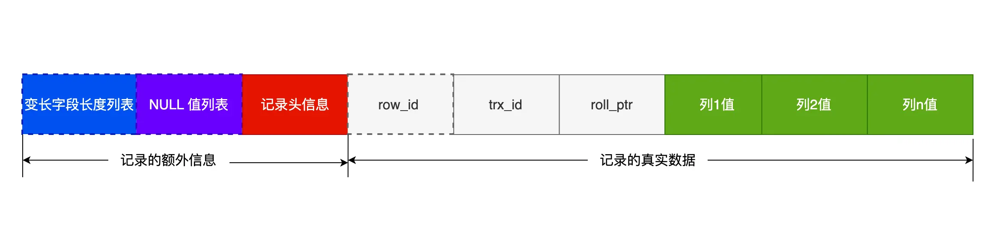
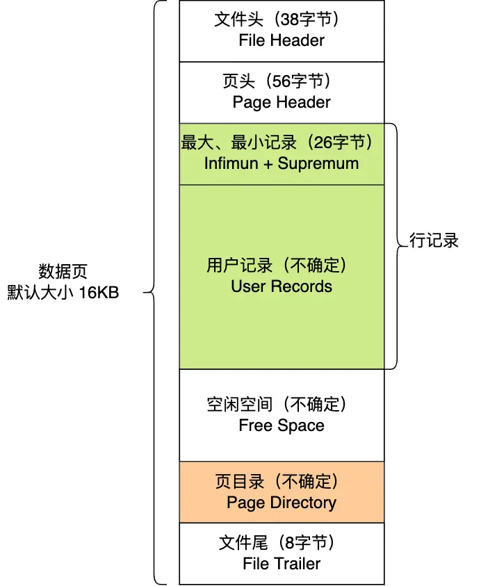
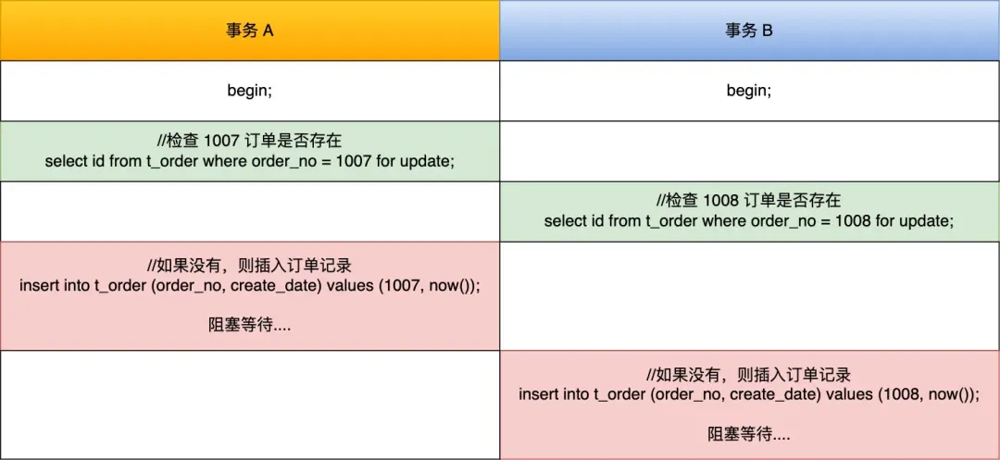

# 基础篇

## 一条select语句怎么执行


MySQL架构分两层：**Server层**和**存储引擎层 **

- Server层：建立连接、分析和执行SQL
- 存储引擎层：数据的存储和提取


### 连接器

1. 与客户端进行三次握手链接

    - 分为长连接和短连接（一般推荐长连接）

        ```java
        // 短连接
        连接 mysql 服务（TCP 三次握手）
        执行sql
        断开 mysql 服务（TCP 四次挥手）
        
        // 长连接
        连接 mysql 服务（TCP 三次握手）
        执行sql
        执行sql
        执行sql
        ....
        断开 mysql 服务（TCP 四次挥手）
        ```

    - 长连接可以减少建立连接和断开连接的过程，但是连接对象的资源会占用内存

    - 如何解决长连接占用内存的问题？

        - 定期断开长连接
        - 客户端主动重置连接

2. 校验用户名和密码，如果用户名和密码不正确就会报错

3. 如果用户名和密码正确，会读取该用户的权限，并存起来，后面的所有权限逻辑都基于**此时读取到的权限**，即管理员在此时更改了权限，用户不会有感知，只有在下一次链接的时候才体现出来


### 查询缓存

对于频繁更新的表，查询缓存的命中率极低，所以MySQL8.0将查询缓存这一步骤删掉了

>  TIP
>
> 这里说的查询缓存是 server 层的，也就是 MySQL 8.0 版本移除的是 server 层的查询缓存，并不是 Innodb 存储引擎中的 buffer pool。


### 解析SQL

- 语法分析
- 词法分析


### 执行SQL

1. 预处理

- 检查SQL语句中的表或字段是否存在
- 将 `select * `  中的 `*` 拓展为表上的所有列

2. 优化器

确定SQL查询语句的执行方案，如使用什么索引，使用成本最小的执行计划

3. 执行器

根据执行方案执行SQL查询语句，从存储引擎读取记录，返回给客户端

- 读一条返回一条，客户端接收到所有结果之后才呈现


## MySQL一行记录是如何储存的

### MySQL数据存在哪个文件

```shell
mysql> SHOW VARIABLES LIKE 'datadir';
+---------------+-----------------+
| Variable_name | Value           |
+---------------+-----------------+
| datadir       | /var/lib/mysql/ |
+---------------+-----------------+
1 row in set (0.00 sec)
```

进入查看

```shell
[root@xiaolin ~]#ls /var/lib/mysql/my_test
db.opt  
t_order.frm  
t_order.ibd
```

- db.opt，用来存储当前数据库的**默认字符集和字符校验规则**。
- t_order.frm ，t_order 的**表结构**会保存在这个文件。在 MySQL 中建立一张表都会生成一个.frm 文件，该文件是用来保存每个表的元数据信息的，**主要包含表结构定义**。
- t_order.ibd，t_order 的**表数据**会保存在这个文件。表数据既可以存在共享表空间文件（文件名：ibdata1）里，也可以存放在独占表空间文件（文件名：表名字.ibd）。这个行为是由参数 innodb_file_per_table 控制的，若设置了参数 innodb_file_per_table 为 1，则会将存储的数据、索引等信息单独存储在一个独占表空间，从 MySQL 5.6.6 版本开始，它的默认值就是 1 了，因此从这个版本之后， MySQL 中每一张表的数据都存放在一个独立的 .ibd 文件。


### 表空间结构

表空间由**段（segment）、区（extent）、页（page）、行（row）**组成，InnoDB存储引擎的逻辑存储结构大致如下图：


#### 1、行（row）

数据库表中的记录都是按行（row）进行存放的，每行记录根据不同的行格式，有不同的存储结构。

#### 2、页（page）

记录是按照行来存储的，但是数据库的读取并不以「行」为单位，否则一次读取（也就是一次 I/O 操作）只能处理一行数据，效率会非常低。

因此，**InnoDB 的数据是按「页」为单位来读写的**，也就是说，当需要读一条记录的时候，并不是将这个行记录从磁盘读出来，而是以页为单位，将其整体读入内存。

**默认每个页的大小为 16KB**，也就是最多能保证 16KB 的连续存储空间。

页是 InnoDB 存储引擎磁盘管理的最小单元，意味着数据库每次读写都是以 16KB 为单位的，一次最少从磁盘中读取 16K 的内容到内存中，一次最少把内存中的 16K 内容刷新到磁盘中。

页的类型有很多，常见的有数据页、undo 日志页、溢出页等等。数据表中的行记录是用「数据页」来管理的，表中的记录存储在「数据页」里面。

#### 3、区（extent）

我们知道 InnoDB 存储引擎是用 B+ 树来组织数据的。

B+ 树中每一层都是通过双向链表连接起来的，如果是以页为单位来分配存储空间，那么链表中相邻的两个页之间的物理位置并不是连续的，可能离得非常远，那么磁盘查询时就会有大量的随机I/O，随机 I/O 是非常慢的。

解决这个问题也很简单，就是让链表中相邻的页的物理位置也相邻，这样就可以使用顺序 I/O 了，那么在范围查询（扫描叶子节点）的时候性能就会很高。

那具体怎么解决呢？

**在表中数据量大的时候，为某个索引分配空间的时候就不再按照页为单位分配了，而是按照区（extent）为单位分配。每个区的大小为 1MB，对于 16KB 的页来说，连续的 64 个页会被划为一个区，这样就使得链表中相邻的页的物理位置也相邻，就能使用顺序 I/O 了**。

#### 4、段（segment）

表空间是由各个段（segment）组成的，段是由多个区（extent）组成的。段一般分为数据段、索引段和回滚段等。

* 索引段：存放 B + 树的非叶子节点的区的集合；
* 数据段：存放 B + 树的叶子节点的区的集合；
* 回滚段：存放的是回滚数据的区的集合


### InnoDB行格式分类

* Redundant 是很古老的行格式了， MySQL 5.0 版本之前用的行格式，现在基本没人用了。
* 由于 Redundant 不是一种紧凑的行格式，所以 MySQL 5.0 之后引入了 Compact 行记录存储方式，Compact 是一种紧凑的行格式，设计的初衷就是为了让一个数据页中可以存放更多的行记录，从 MySQL 5.1 版本之后，行格式默认设置成 Compact。
* Dynamic 和 Compressed 两个都是紧凑的行格式，它们的行格式都和 Compact 差不多，因为都是基于 Compact 改进一点东西。从 MySQL5.7 版本之后，默认使用 Dynamic 行格式。


### COMPACT行格式

结构如下：



#### 记录的额外信息

1. 变长字段长度列表

    **==逆序存放==**如varchar、TEXT、BLOB等变长字段的**真实数据占用的字节数**

    「变长字段长度列表」中的信息之所以要逆序存放，是因为这样可以**使得位置靠前的记录的真实数据和数据对应的字段长度信息可以同时在一个 CPU Cache Line 中，这样就可以==提高 CPU Cache 的命中率==**

    其实变长字段字节数列表**不是必须的**。

    **当数据表没有变长字段的时候，比如全部都是 int 类型的字段，这时候表里的行格式就不会有「变长字段长度列表」了**，因为没必要，不如去掉以节省空间。

    所以「变长字段长度列表」只出现在数据表有变长字段的时候

2. NULL值列表

    如果存在允许 NULL 值的列，则每个列对应一个二进制位（bit），二进制位按照列的顺序逆序排列。

    * 二进制位的值为`1`时，代表该列的值为NULL。
    * 二进制位的值为`0`时，代表该列的值不为NULL。

    也是**==逆序存放==**

    NULL 值列表**也不是必须的**。

    **当数据表的字段都定义成 NOT NULL 的时候，这时候表里的行格式就不会有 NULL 值列表了**。

    NULL值列表的长度是1个字节的整数倍，假设有9个NULL值，那么NULL值列表的长度就会是2个字节

3. 记录头信息

    * delete_mask ：标识此条数据是否被删除。从这里可以知道，我们执行 detele 删除记录的时候，并不会真正的删除记录，只是将这个记录的 delete_mask 标记为 1。
    * next_record：下一条记录的位置。从这里可以知道，记录与记录之间是通过链表组织的。在前面我也提到了，指向的是下一条记录的「记录头信息」和「真实数据」之间的位置，这样的好处是向左读就是记录头信息，向右读就是真实数据，比较方便。
    * record_type：表示当前记录的类型，0表示普通记录，1表示B+树非叶子节点记录，2表示最小记录，3表示最大记录


#### 记录的真实数据

* row_id

    如果我们建表的时候指定了主键或者唯一约束列，那么就没有 row_id 隐藏字段了。如果既没有指定主键，又没有唯一约束，那么 InnoDB 就会为记录添加 row_id 隐藏字段。**row_id不是必需的**，占用 6 个字节。

* trx_id

    事务id，表示这个数据是由哪个事务生成的。 **trx_id是必需的**，占用 6 个字节。

* roll_pointer

    这条记录上一个版本的指针。**roll_pointer 是必需的**，占用 7 个字节。


### varchar（n）最大取值多少

我们要清楚一点，MySQL 规定除了 TEXT、BLOBs 这种大对象类型之外，其他所有的列（不包括隐藏列和记录头信息）占用的字节长度加起来不能超过**$2^{16}-1=65535$ 个字节**。

「变长字段长度列表」+ 「NULL 值列表」+ 「真实数据」所占用的字节数要小于等于65535，所以n的大小还取决于字符集的编码

- 若采用ASCII码，一个字符只占用1个字节，那么 n 最大取值为65535-2（变长字段长度列表）-1（NULL值列表）=65532
- 若采用UTF-8编码，一个字符占用3个字节，那么 n 最大取值为65532/3=21844


### 行溢出后，MySQL怎么处理

MySQL 中磁盘和内存交互的基本单位是页，一个页的大小一般是 `16KB`，也就是 `16384字节`，而一个 varchar(n) 类型的列最多可以存储 `65532字节`，一些大对象如 TEXT、BLOB 可能存储更多的数据，这时一个页可能就存不了一条记录。这个时候就会**发生行溢出，多的数据就会存到另外的「溢出页」中**。

- COMPACT行格式

    当发生行溢出时，在记录的真实数据处**只会保存该列的一部分数据，而把剩余的数据放在「溢出页」中**，然后真实数据处用 **20 字节**存储指向溢出页的地址，从而可以找到剩余数据所在的页。

    

- compressed和Dynamic行格式

    当发生行溢出时，**记录的真实数据处不会存储该列的数据，只存储 20 个字节的指针来指向溢出页**。**而实际的数据都存储在溢出页中**。

    


# 索引篇

## 什么是索引

数据库中，索引的定义就是帮助存储引擎快速获取数据的一种数据结构，形象的说就是**索引是数据的目录**。

* 按「数据结构」分类：**B+tree索引、Hash索引、Full-text索引**。
* 按「物理存储」分类：**聚簇索引（主键索引）、二级索引（辅助索引）**。
* 按「字段特性」分类：**主键索引、唯一索引、普通索引、前缀索引**。
* 按「字段个数」分类：**单列索引、联合索引**。


## B+树的优点

***1、B+Tree vs B Tree***

B+Tree 只在叶子节点存储数据，而 B 树 的非叶子节点也要存储数据，所以 B+Tree 的单个节点的数据量更小，在相同的磁盘 I/O 次数下，就能查询更多的节点。

另外，B+Tree 叶子节点采用的是双链表连接，适合 MySQL 中常见的基于范围的顺序查找，而 B 树无法做到这一点。

***2、B+Tree vs 二叉树***

对于有 N 个叶子节点的 B+Tree，其搜索复杂度为`O(logdN)`，其中 d 表示节点允许的最大子节点个数为 d 个。

在实际的应用当中， d 值是大于100的，这样就保证了，即使数据达到千万级别时，B+Tree 的高度依然维持在 3~4 层左右，也就是说一次数据查询操作只需要做 3~4 次的磁盘 I/O 操作就能查询到目标数据。

而二叉树的每个父节点的儿子节点个数只能是 2 个，意味着其搜索复杂度为 `O(logN)`，这已经比 B+Tree 高出不少，因此二叉树检索到目标数据所经历的磁盘 I/O 次数要更多。

***3、B+Tree vs Hash***

Hash 在做等值查询的时候效率贼快，搜索复杂度为 O(1)。

但是 Hash 表不适合做范围查询，它更适合做等值的查询，这也是 B+Tree 索引要比 Hash 表索引有着更广泛的适用场景的原因


## 索引分类

### 按数据结构分

在创建表时，InnoDB 存储引擎会根据不同的场景选择不同的列作为索引：

* 如果有主键，默认会使用主键作为聚簇索引的索引键（key）；
* 如果没有主键，就选择第一个不包含 NULL 值的唯一列作为聚簇索引的索引键（key）；
* 在上面两个都没有的情况下，InnoDB 将自动生成一个隐式自增 id 列作为聚簇索引的索引键（key）；

其它索引都属于辅助索引（Secondary Index），也被称为二级索引或非聚簇索引。**创建的主键索引和二级索引默认使用的是 B+Tree 索引**。

二级索引的叶子节点存储的是主键的值，通过主键的值再查询其他的数据，这个过程叫做**「回表」，也就是说要查两个 B+Tree 才能查到数据**。

如果在二级索引的B+Tree就能查到结果，这个过程叫做**「覆盖索引」，也就是只用查一个B+Tree就能查到数据。**


### 按物理存储分类

从物理存储的角度来看，索引分为聚簇索引（主键索引）、二级索引（辅助索引）。


### 按字段特性分类

从字段特性的角度来看，索引分为主键索引、唯一索引、普通索引、前缀索引。

#### 主键索引

一张表只能有一个主键索引，且索引不能有空值

```mysql
CREATE TABLE table_name  (
  ....
  PRIMARY KEY (index_column_1) USING BTREE
);
```


#### 唯一索引

一张表可以有多个唯一索引，索引列的值必须唯一，且允许有空值

```mysql
-- 建表时增加索引
CREATE TABLE table_name  (
  ....
  UNIQUE KEY(index_column_1,index_column_2,...) 
);

-- 建表后增加索引
CREATE UNIQUE INDEX index_name
ON table_name(index_column_1,index_column_2,...); 
```


#### 普通索引

普通索引就是在普通字段上增加索引，不要求唯一

```mysql
-- 建表时增加索引
CREATE TABLE table_name  (
  ....
  INDEX(index_column_1,index_column_2,...) 
);

-- 建表后增加索引
CREATE INDEX index_name
ON table_name(index_column_1,index_column_2,...); 
```


#### 前缀索引

前缀索引是对字符类型字段的前几个字符增加索引，而不是对整个字段增加索引，支持的字段类型为`char`、` varchar`、`binary`、`varbinary`

前缀索引可以减少索引占据的物理空间，提高查询效率

```mysql
-- 建表时增加索引
CREATE TABLE table_name(
    column_list,
    INDEX(column_name(length))
)

-- 建表后增加索引
CREATE INDEX index_name
ON table_name(column_name(length)); 
```


### 按字段个数分类

从字段个数的角度来看，索引分为单列索引、联合索引（复合索引）。

* 建立在单列上的索引称为单列索引，比如主键索引；
* 建立在多列上的索引称为联合索引；

#### 联合索引

联合索引存在**最左匹配原则**，若不遵循，索引会失效

例子：

如果创建了一个 `(a,b,c)` 联合索引，以下查询条件可以匹配联合索引：

* where a=1；
* where a=1 and b=2 and c=3；
* where a=1 and b=2；

查询优化器会优化 a 字段的位置，所以 a 字段在 where 子句中的顺序不重要

以下查询条件索引会失效：

* where b=2；
* where c=3；
* where b=2 and c=3；

原因：**b 和 c 是全局无序，局部相对有序的**

 一个`(a,b)`联合索引的B+Tree结构如下图所示（**注意叶子节点是双向链表**）：


#### 索引下推

对于联合索引（a, b），在执行 `select * from table where a > 1 and b = 2` 语句的时候，只有 a 字段能用到索引，那在联合索引的 B+Tree 找到第一个满足条件的主键值（ID 为 2）后，还需要判断其他条件是否满足（看 b 是否等于 2），那是在联合索引里判断？还是回主键索引去判断呢？

* 在 MySQL 5.6 之前，只能从 ID2 （主键值）开始一个个回表，到「主键索引」上找出数据行，再对比 b 字段值。
* 而 MySQL 5.6 引入的**索引下推优化**（index condition pushdown)， **可以在联合索引遍历过程中，对联合索引中包含的字段先做判断，直接过滤掉不满足条件的记录，减少回表次数**

当你的查询语句的执行计划里，出现了 Extra 为 `Using index condition`，那么说明使用了索引下推的优化。


#### 联合索引进行排序

针对针对下面这条 SQL，你怎么通过索引来提高查询效率呢？

```sql
select * from order where status = 1 order by create_time asc
```

有的同学会认为，单独给 status 建立一个索引就可以了。

但是更好的方式给 status 和 create_time 列建立一个联合索引，因为这样可以避免 MySQL 数据库发生文件排序。

因为在查询时，如果只用到 status 的索引，但是这条语句还要对 create_time 排序，这时就要用文件排序 filesort，也就是在 SQL 执行计划中，Extra 列会出现 Using filesort。

所以，要利用索引的有序性，在 status 和 create_time 列建立联合索引，这样根据 status 筛选后的数据就是按照 create_time 排好序的，避免在文件排序，提高了查询效率


## 什么时候需要/不需要创建索引

**什么时候适用索引**？

* 字段有唯一性限制的，比如商品编码；
* 经常用于 `WHERE` 查询条件的字段，这样能够提高整个表的查询速度，如果查询条件不是一个字段，可以建立联合索引。
* 经常用于 `GROUP BY` 和 `ORDER BY` 的字段，这样在查询的时候就不需要再去做一次排序了，因为我们都已经知道了建立索引之后在 B+Tree 中的记录都是排序好的。

**什么时候不需要创建索引**？

* `WHERE` 条件，`GROUP BY`，`ORDER BY` 里用不到的字段，索引的价值是快速定位，如果起不到定位的字段通常是不需要创建索引的，因为索引是会占用物理空间的。
* 字段中存在大量重复数据，不需要创建索引，比如性别字段，只有男女，如果数据库表中，男女的记录分布均匀，那么无论搜索哪个值都可能得到一半的数据。在这些情况下，还不如不要索引，因为 MySQL 还有一个查询优化器，查询优化器发现某个值出现在表的数据行中的百分比很高的时候，它一般会忽略索引，进行全表扫描。
* 表数据太少的时候，不需要创建索引；
* 经常更新的字段不用创建索引，比如不要对电商项目的用户余额建立索引，因为索引字段频繁修改，由于要维护 B+Tree的有序性，那么就需要频繁的重建索引，这个过程是会影响数据库性能的。


## 索引优化

### 前缀索引优化

优点：

- 减少存储空间的使用

缺点：

- order by 无法使用前缀索引
- 无法把前缀索引用作覆盖索引


### 覆盖索引

其实就是索引下推

利用联合索引，避免回表


### 主键索引最好自增

**如果我们使用自增主键**，那么每次插入的新数据就会按顺序添加到当前索引节点的位置，不需要移动已有的数据，当页面写满，就会自动开辟一个新页面。因为每次**插入一条新记录，都是追加操作，不需要重新移动数据**，因此这种插入数据的方法效率非常高。

**如果我们使用非自增主键**，由于每次插入主键的索引值都是随机的，因此每次插入新的数据时，就可能会插入到现有数据页中间的某个位置，这将不得不移动其它数据来满足新数据的插入，甚至需要从一个页面复制数据到另外一个页面，我们通常将这种情况称为**页分裂**。**页分裂还有可能会造成大量的内存碎片，导致索引结构不紧凑，从而影响查询效率**。


### 索引最好设置为NOT  NULL

原因：

- 第一原因：索引列存在 NULL 就会导致优化器在做索引选择的时候更加复杂，更加难以优化，因为可为 NULL 的列会使索引、索引统计和值比较都更复杂，比如进行索引统计时，count 会省略值为NULL 的行。
- 第二个原因：NULL 值是一个没意义的值，但是它会占用物理空间，所以会带来的存储空间的问题，因为 InnoDB 存储记录的时候，如果表中存在允许为 NULL 的字段，那么行格式中**至少会用 1 字节空间存储 NULL 值列表**


## 索引失效

发生索引失效的情况：

* 当我们使用左或者左右模糊匹配的时候，也就是 `like %xx` 或者 `like %xx%`这两种方式都会造成索引失效；

* 当我们在查询条件中对索引列做了计算、函数，如 `select * from t_user where id + 1 = 10` ；

    但是MySQL8.0之后，索引类型增加了函数索引，可以针对**函数计算过后的值**建立一个索引；

* 隐式类型转换操作，如

    ```mysql
    -- phone是varchar类型
    select * from t_user where phone = 1300000001;
    
    -- 相当于
    select * from t_user where CAST(phone AS signed int) = 1300000001;
    -- 对字段 phone 使用了函数
    ```

    以上结果是全表扫描，原因是： MySQL 在遇到字符串和数字比较的时候**，会自动把字符串转为数字**，然后再进行比较。

* 联合索引要能正确使用需要遵循**最左匹配原则**，也就是按照最左优先的方式进行索引的匹配，否则就会导致索引失效。

* 在 WHERE 子句中，如果在 OR 前的条件列是索引列，而在 OR 后的条件列不是索引列，那么索引会失效。因为两个条件只需要满足一个即可，OR 后面的条件如果不是索引列，一定会全表扫描


## 从数据页的角度看B+树

InnoDB 的数据是按**「数据页」**为单位来读写的，默认大小是 **16KB**

数据页结构如下：




那 InnoDB 是如何给记录创建页目录的呢？页目录与记录的关系如下图：


InnoDB 里的 B+ 树中的**每个节点都是一个数据页**，结构示意图如下：


# 事务篇

## 事务特性

- 原子性（Atomicity）：一个事务中的所有操作要么全部完成，要么全部不完成，不会结束在中间的某个环节。若事务在执行过程发生错误，就会回滚到事务开始之前的状态
- 一致性（Consistency）：事务开始前和结束后，数据满足完成性约束，数据库保持一致性状态
- 隔离性（Insulation）：每个事务都有一个完整的数据空间，对其他并发事务是隔离的
- 持久性（Durability）：事务处理结束后，对数据的修改是永久的，即使系统故障也不会丢失

InnoDB通过什么技术保证事务的四个特性？

- 原子性通过undo log（回滚日志）来保证
- 一致性通过原子性+持久性+隔离性来保证
- 隔离性通过MVVC（多版本并发控制）或锁机制来保证
- 持久性通过redo log（重做日志）来保证


## 并行事务可能会引发的问题

### 脏读

**如果一个事务「读到」了另一个「未提交事务修改过的数据」，就意味着发生了「脏读」现象。**


### 不可重复读

**在一个事务内多次读取同一个数据，如果出现前后两次读到的数据不一样的情况，就意味着发生了「不可重复读」现象。**


### 幻读

**在一个事务内多次查询某个符合查询条件的「记录数量」，如果出现前后两次查询到的记录数量不一样的情况，就意味着发生了「幻读」现象。**


### 总结

- 脏读：读到其他事务未提交的数据
- 不可重复读：前后读取的数据不一致
- 幻读：前后读取的记录数量不一致

严重程度从上往下越来越轻


## 事务的隔离级别

SQL 标准提出了四种隔离级别来规避上述现象，隔离级别越高，性能效率就越低，这四个隔离级别如下：

- 读未提交（read uncommitted）：一个事务未提交，它做的变更就能被其他事务看到
- 读提交（read committed）：一个事务提交之后，它做的变更才能被其他事务看到
- 可重复读（repeatable read）：一个事务执行过程中看到的数据，一直跟这个事务在开始的时候看到的数据保持一致。**MySQL InnoDB的默认隔离级别**
- 串行化（serializable）：对记录上锁，发生读写冲突时，后访问的事务必须等待前一个事务执行完成，才能继续执行


* 在「读未提交」隔离级别下，可能发生脏读、不可重复读和幻读现象；
* 在「读提交」隔离级别下，可能发生不可重复读和幻读现象，但是不可能发生脏读现象；
* 在「可重复读」隔离级别下，可能发生幻读现象，但是不可能脏读和不可重复读现象；
* 在「串行化」隔离级别下，脏读、不可重复读和幻读现象都不可能会发生。


## Read View 在 MCVV 里如何工作

Read View 结构如下：


* m_ids ：指的是在创建 Read View 时，当前数据库中「活跃事务」的**事务 id 列表**，注意是一个列表，**“活跃事务”指的就是，启动了但还没提交的事务**。
* min_trx_id ：指的是在创建 Read View 时，当前数据库中「活跃事务」中事务 **id 最小的事务**，也就是 m_ids 的最小值。
* max_trx_id ：这个并不是 m_ids 的最大值，而是**创建 Read View 时当前数据库中应该给下一个事务的 id 值**，也就是全局事务中最大的事务 id 值 + 1；
* creator_trx_id ：指的是**创建该 Read View 的事务的事务 id**。

知道了 Read View 的字段，我们还需要了解聚簇索引记录中的两个隐藏列。


* trx_id，当一个事务对某条聚簇索引记录进行改动时，就会**把该事务的事务 id 记录在 trx_id 隐藏列里**；
* roll_pointer，每次对某条聚簇索引记录进行改动时，都会把旧版本的记录写入到 undo 日志中，然后**这个隐藏列是个指针，指向每一个旧版本记录**，于是就可以通过它找到修改前的记录。


在创建 Read View 后，我们可以将记录中的 trx_id 划分这三种情况：


一个事务去访问记录的时候，除了自己的更新记录总是可见之外，还有这几种情况：

* 如果记录的 trx_id 值小于 Read View 中的 `min_trx_id` 值，表示这个版本的记录是在创建 Read View **前**已经提交的事务生成的，所以该版本的记录对当前事务**可见**。
* 如果记录的 trx_id 值大于等于 Read View 中的 `max_trx_id` 值，表示这个版本的记录是在创建 Read View **后**才启动的事务生成的，所以该版本的记录对当前事务**不可见**。
* 如果记录的 trx_id 值在 Read View 的`min_trx_id`和 `max_trx_id` 之间，需要判断 trx_id 是否在 m_ids 列表中：
    * 如果记录的 trx_id **在** `m_ids` 列表中，表示生成该版本记录的活跃事务依然活跃着（还没提交事务），所以该版本的记录对当前事务**不可见**。
    * 如果记录的 trx_id **不在** `m_ids`列表中，表示生成该版本记录的活跃事务已经被提交，所以该版本的记录对当前事务**可见**。

**这种通过「版本链」来控制并发事务访问同一个记录时的行为就叫 MVCC（多版本并发控制）**


**可重复读隔离级别：启动事务时生成一个 Read View，然后整个事务期间都在用这个 Read View**

**读提交隔离级别：在每次读取数据时，都会生成一个新的 Read View**。


## 如何解决幻读

MySQL InnoDB 引擎的可重复读隔离级别（默认隔离级），根据不同的查询方式，分别提出了避免幻读的方案：

* 针对**快照读**（普通 select 语句），是通过 MVCC 方式解决了幻读。

* 针对**当前读**（select ... for update 等语句），是通过 next-key lock（记录锁+间隙锁）方式解决了幻读。

    如：

    ```mysql
    -- 事务A
    begin;
    select name from t_stu where id > 2 for update; -- 给id在(2,+∞]的记录上了next-key lock
    
    -- 事务2
    begin;
    insert into t_stu values(5,"Tension"); -- 这里会一直阻塞
    commit;
    ```

**无法避免的幻读：**

第一个例子：对于快照读， MVCC 并不能完全避免幻读现象。因为当事务 A 更新了一条事务 B 插入的记录，那么事务 A 前后两次查询的记录条目就不一样了，所以就发生幻读。

第二个例子：对于当前读，如果事务开启后，并没有执行当前读，而是先快照读，然后这期间如果其他事务插入了一条记录，那么事务后续使用当前读进行查询的时候，就会发现两次查询的记录条目就不一样了，所以就发生幻读。

所以，**MySQL 可重复读隔离级别并没有彻底解决幻读，只是很大程度上避免了幻读现象的发生。**

要避免这类特殊场景下发生幻读的现象的话，就是**尽量在开启事务之后，马上执行 select ... for update 这类当前读的语句**，因为它会对记录加 next-key lock，从而避免其他事务插入一条新记录。


# 锁篇

## 行级锁种类

### Record Lock

Record Lock 称为记录锁，锁住的是一条记录。而且记录锁是有 S 锁和 X 锁之分的：

* 当一个事务对一条记录加了 S 型记录锁后，其他事务也可以继续对该记录加 S 型记录锁（S 型与 S 锁兼容），但是不可以对该记录加 X 型记录锁（S 型与 X 锁不兼容）;
* 当一个事务对一条记录加了 X 型记录锁后，其他事务既不可以对该记录加 S 型记录锁（S 型与 X 锁不兼容），也不可以对该记录加 X 型记录锁（X 型与 X 锁不兼容）。

如当一个事务执行以下代码：

```sql
mysql > begin;
mysql > select * from t_test where id = 1 for update;
```

当其他事务更新或者删除 `id = 1` 这条记录时会被阻塞。插入不受影响，但是会主键冲突的错误

 


### Gap Lock

Gap Lock 称为间隙锁，只存在于可重复读隔离级别，目的是为了解决可重复读隔离级别下幻读的现象。

假设，表中有一个范围 id 为（3，5）间隙锁，那么其他事务就无法插入 id = 4 这条记录了，这样就有效的防止幻读现象的发生。


间隙锁虽然存在 X 型间隙锁和 S 型间隙锁，但是并没有什么区别，**间隙锁之间是兼容的，即两个事务可以同时持有包含共同间隙范围的间隙锁，并不存在互斥关系，因为间隙锁的目的是防止插入幻影记录而提出的**。


### Next-Key Lock

Next-Key Lock 称为临键锁，是 Record Lock + Gap Lock 的组合，锁定一个范围，并且锁定记录本身。

**next-key lock 是包含间隙锁+记录锁的，如果一个事务获取了 X 型的 next-key lock，那么另外一个事务在获取相同范围的 X 型的 next-key lock 时，是会被阻塞的**。因为Record Lock的X锁会阻塞


## MySQL是怎么加锁的

MySQL加锁的对象是**索引**


### MySQL加锁的语句

普通的 select 语句是不会对记录加锁的（除了串行化隔离级别），因为它属于快照读，是通过 MVCC（多版本并发控制）实现的。

如果要在查询时对记录加行级锁，可以使用下面这两个方式，这两种查询会加锁的语句称为**锁定读**。

```sql
//对读取的记录加共享锁(S型锁)
select ... lock in share mode;

//对读取的记录加独占锁(X型锁)
select ... for update;
```

上面这两条语句必须在一个事务中，**因为当事务提交了，锁就会被释放**，所以在使用这两条语句的时候，要加上 begin 或者 start transaction 开启事务的语句。

**除了上面这两条锁定读语句会加行级锁之外，update 和 delete 操作都会加行级锁，且锁的类型都是独占锁(X型锁)**。

```sql
//对操作的记录加独占锁(X型锁)
update table .... where id = 1;

//对操作的记录加独占锁(X型锁)
delete from table where id = 1;
```


### 唯一索引等值查询

* 当查询的记录是「存在」的，在索引树上定位到这一条记录后，将该记录的索引中的 next-key lock 会**退化成「记录锁」**。
* 当查询的记录是「不存在」的，在索引树找到第一条大于该查询记录的记录后，将该记录的索引中的 next-key lock 会**退化成「间隙锁」**。


### 唯一索引范围查询

当唯一索引进行范围查询时，**会对每一个扫描到的索引加 next-key 锁，然后如果遇到下面这些情况，会退化成记录锁或者间隙锁**：

* 情况一：针对「大于等于」的范围查询，因为存在等值查询的条件，那么如果等值查询的记录是存在于表中，那么该记录的索引中的 next-key 锁会**退化成记录锁**。
* 情况二：针对「小于或者小于等于」的范围查询，要看条件值的记录是否存在于表中：
    * 当条件值的记录不在表中，那么不管是「小于」还是「小于等于」条件的范围查询，**扫描到终止范围查询的记录时，该记录的索引的 next-key 锁会退化成间隙锁**，其他扫描到的记录，都是在这些记录的索引上加 next-key 锁。
    * 当条件值的记录在表中，如果是「小于」条件的范围查询，**扫描到终止范围查询的记录时，该记录的索引的 next-key 锁会退化成间隙锁**，其他扫描到的记录，都是在这些记录的索引上加 next-key 锁；如果「小于等于」条件的范围查询，扫描到终止范围查询的记录时，该记录的索引 next-key 锁不会退化成间隙锁。其他扫描到的记录，都是在这些记录的索引上加 next-key 锁。


### 非唯一索引等值查询

* 当查询的记录「存在」时，由于不是唯一索引，所以肯定存在索引值相同的记录，于是非唯一索引等值查询的过程是一个扫描的过程，直到扫描到第一个不符合条件的二级索引记录就停止扫描，然后**在扫描的过程中，对扫描到的二级索引记录加的是 next-key 锁，而对于第一个不符合条件的二级索引记录，该二级索引的 next-key 锁会退化成间隙锁。同时，在符合查询条件的记录的主键索引上加记录锁**。
* 当查询的记录「不存在」时，**扫描到第一条不符合条件的二级索引记录，该二级索引的 next-key 锁会退化成间隙锁。因为不存在满足查询条件的记录，所以不会对主键索引加锁**。


### 非唯一索引范围查询

非唯一索引和主键索引的范围查询的加锁也有所不同，不同之处在于**非唯一索引范围查询，索引的 next-key lock 不会有退化为间隙锁和记录锁的情况**，也就是非唯一索引进行范围查询时，对二级索引记录加锁都是加 next-key 锁。


### 没有加索引的查询

- 如果**锁定读**查询语句，没有使用索引列作为查询条件，或者查询语句没有走索引查询，导致扫描是全表扫描。那么，每一条记录的索引上都会加 next-key 锁，这样就相当于锁住的全表，这时如果其他事务对该表进行增、删、改操作的时候，都会被阻塞。
- **update 和 delete 语句**如果查询条件不加索引，那么由于扫描的方式是全表扫描，于是就会对每一条记录的索引上都会加 next-key 锁，这样就相当于锁住的全表。

在执行 update、delete、select ... for update 等具有加锁性质的语句，一定要检查语句是否走了索引，**如果是全表扫描的话，会对每一个索引加 next-key 锁，相当于把整个表锁住了**，这是挺严重的问题


## MySQL死锁怎么办

### 死锁怎么产生




### Insert语句如何产生行锁

#### 隐式锁

Insert语句正常执行不会产生锁结构，而是靠聚簇索引记录自带的 `trx_id` 隐藏列作为**隐式锁**来保护记录。

当事务需要加锁的时，如果这个锁不可能发生冲突，InnoDB会跳过加锁环节，这种机制称为隐式锁。隐式锁是 InnoDB 实现的一种延迟加锁机制，其特点是只有在可能发生冲突时才加锁，从而减少了锁的数量，提高了系统整体性能。


### 什么情况下，隐式锁转为显示锁

#### 记录之间有间隙锁

如果遇到间隙锁，会生成一个**插入意向锁**，锁的状态是**等待状态**，Insert语句被阻塞

#### 唯一键冲突

如果在插入新记录时，插入了一个与「已有的记录的主键或者唯一二级索引列值相同」的记录（不过可以有多条记录的唯一二级索引列的值同时为NULL，这里不考虑这种情况），此时插入就会失败，然后对于这条记录加上了 **S 型的锁**。

* 如果主键索引重复，插入新记录的事务会给已存在的主键值重复的聚簇索引记录**添加 S 型记录锁**。
* 如果唯一二级索引重复，插入新记录的事务都会给已存在的二级索引列值重复的二级索引记录**添加 S 型 next-key 锁**


### 如何避免死锁

- 设置事务等待锁的超时时间

    在 InnoDB 中，参数 `innodb_lock_wait_timeout` 是用来设置超时时间的，默认值时 50 秒。

- 主动开启死锁检测

    参数 `innodb_deadlock_detect` 设置为 on，表示开启这个逻辑，默认就开启


# 日志篇

## undo log

**undo log 两大作用：**

* **实现事务回滚，保障事务的原子性**。事务处理过程中，如果出现了错误或者用户执 行了 ROLLBACK 语句，MySQL 可以利用 undo log 中的历史数据将数据恢复到事务开始之前的状态。
* **实现 MVCC（多版本并发控制）关键因素之一**。MVCC 是通过 ReadView + undo log 实现的。undo log 为每条记录保存多份历史数据，MySQL 在执行快照读（普通 select 语句）的时候，会根据事务的 Read View 里的信息，顺着 undo log 的版本链找到满足其可见性的记录。


## redo log

**什么是redo log**

redo log 是物理日志，记录了某个数据页做了什么修改，比如**对 XXX 表空间中的 YYY 数据页 ZZZ 偏移量的地方做了AAA 更新**，每当执行一个事务就会产生这样的一条或者多条物理日志。


## binlog

**redo log 和 binlog 有什么区别？**

这两个日志有四个区别。

*1、适用对象不同：*

* binlog 是 MySQL 的 Server 层实现的日志，所有存储引擎都可以使用；
* redo log 是 Innodb 存储引擎实现的日志；

*2、文件格式不同：*

* binlog 有 3 种格式类型，分别是 STATEMENT（默认格式）、ROW、 MIXED，区别如下：
    * STATEMENT：每一条修改数据的 SQL 都会被记录到 binlog 中（相当于记录了逻辑操作，所以针对这种格式， binlog 可以称为逻辑日志），主从复制中 slave 端再根据 SQL 语句重现。但 STATEMENT 有动态函数的问题，比如你用了 uuid 或者 now 这些函数，你在主库上执行的结果并不是你在从库执行的结果，这种随时在变的函数会导致复制的数据不一致；
    * ROW：记录行数据最终被修改成什么样了（这种格式的日志，就不能称为逻辑日志了），不会出现 STATEMENT 下动态函数的问题。但 ROW 的缺点是每行数据的变化结果都会被记录，比如执行批量 update 语句，更新多少行数据就会产生多少条记录，使 binlog 文件过大，而在 STATEMENT 格式下只会记录一个 update 语句而已；
    * MIXED：包含了 STATEMENT 和 ROW 模式，它会根据不同的情况自动使用 ROW 模式和 STATEMENT 模式；
* redo log 是物理日志，记录的是在某个数据页做了什么修改，比如对 XXX 表空间中的 YYY 数据页 ZZZ 偏移量的地方做了AAA 更新；

*3、写入方式不同：*

* binlog 是**追加写**，写满一个文件，就创建一个新的文件继续写，不会覆盖以前的日志，保存的是全量的日志。

* redo log 是**循环写**，日志空间大小是固定，全部写满就从头开始，保存未被刷入磁盘的脏页日志。

    **因此当系统崩溃时，只能使用binlog来恢复数据**

*4、用途不同：*

* binlog 用于**备份恢复、主从复制**；
* redo log 用于掉电等故障恢复。


## 两阶段提交

### 概念

**两阶段提交把单个事务的提交拆分成了 2 个阶段，分别是「准备（Prepare）阶段」和「提交（Commit）阶段」**，每个阶段都由协调者（Coordinator）和参与者（Participant）共同完成。注意，不要把提交（Commit）阶段和 commit 语句混淆了，commit 语句执行的时候，会包含提交（Commit）阶段。

举个拳击比赛的例子，两位拳击手（参与者）开始比赛之前，裁判（协调者）会在中间确认两位拳击手的状态，类似于问你准备好了吗？

* **准备阶段**：裁判（协调者）会依次询问两位拳击手（参与者）是否准备好了，然后拳击手听到后做出应答，如果觉得自己准备好了，就会跟裁判说准备好了；如果没有自己还没有准备好（比如拳套还没有带好），就会跟裁判说还没准备好。
* **提交阶段**：如果两位拳击手（参与者）都回答准备好了，裁判（协调者）宣布比赛正式开始，两位拳击手就可以直接开打；如果任何一位拳击手（参与者）回答没有准备好，裁判（协调者）会宣布比赛暂停，对应事务中的回滚操作


### 具体过程

当客户端执行 commit 语句或者在自动提交的情况下，MySQL 内部开启一个 XA 事务，**分两阶段来完成 XA 事务的提交**，如下图：


从图中可看出，事务的提交过程有两个阶段，就是**将 redo log 的写入拆成了两个步骤：prepare 和 commit，中间再穿插写入binlog**，具体如下：

* **prepare 阶段**：将 XID（内部 XA 事务的 ID） 写入到 redo log，同时将 redo log 对应的事务状态设置为 prepare，然后将 redo log 持久化到磁盘（innodb_flush_log_at_trx_commit = 1 的作用）；
* **commit 阶段**：把 XID 写入到 binlog，然后将 binlog 持久化到磁盘（sync_binlog = 1 的作用），接着调用引擎的提交事务接口，将 redo log 状态设置为 commit，此时该状态并不需要持久化到磁盘，只需要 write 到文件系统的 page cache 中就够了，因为只要 binlog 写磁盘成功，就算 redo log 的状态还是 prepare 也没有关系，一样会被认为事务已经执行成功


### 异常重启会发生什么


不管是时刻 A（redo log 已经写入磁盘， binlog 还没写入磁盘），还是时刻 B （redo log 和 binlog 都已经写入磁盘，还没写入 commit 标识）崩溃，**此时的 redo log 都处于 prepare 状态**。

在 MySQL 重启后会按顺序扫描 redo log 文件，碰到处于 prepare 状态的 redo log，就拿着 redo log 中的 XID 去 binlog 查看是否存在此 XID：

* **如果 binlog 中没有当前内部 XA 事务的 XID，说明 redolog 完成刷盘，但是 binlog 还没有刷盘，则回滚事务**。对应时刻 A 崩溃恢复的情况。
* **如果 binlog 中有当前内部 XA 事务的 XID，说明 redolog 和 binlog 都已经完成了刷盘，则提交事务**。对应时刻 B 崩溃恢复的情况。

可以看到，**对于处于 prepare 阶段的 redo log，即可以提交事务，也可以回滚事务，这取决于是否能在 binlog 中查找到与 redo log 相同的 XID**，如果有就提交事务，如果没有就回滚事务。这样就可以保证 redo log 和 binlog 这两份日志的一致性了。

所以说，**两阶段提交是以 binlog 写成功为事务提交成功的标识**，因为 binlog 写成功了，就意味着能在 binlog 中查找到与 redo log 相同的 XID。

