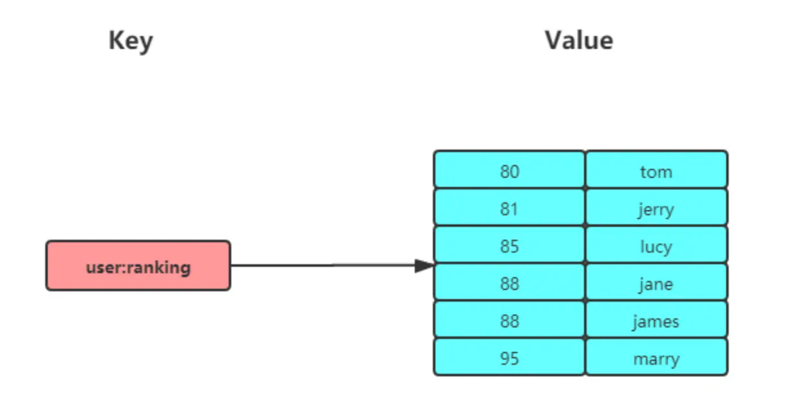
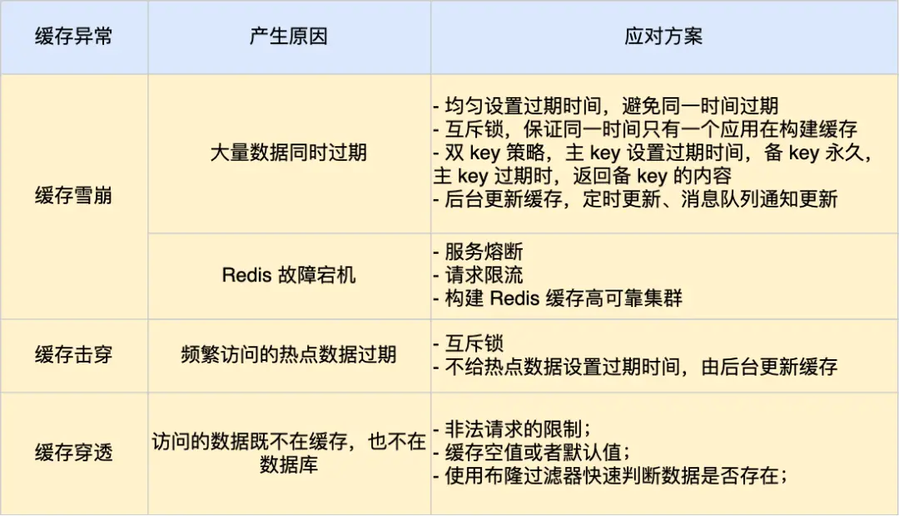

# 数据类型篇

## 常见数据类型及应用场景

### String

String底层的数据结构是int和**SDS**（简单动态字符串），与C语言的字符串相比，SDS有以下优点

- SDS不仅可以保存文本数据，还可以保存二进制数据，因为SDS使用len属性来判断字符串是否结束，而不是空字符串
- SDS维护len内部变量，获取字符串长度的时间复杂度为O（1）
- SDS拼接字符串不会造成缓冲区溢出，因为SDS在拼接之前会检查空间是否满足需求，如果不满足则自动扩容


### List

List底层数据结构由**quickList**实现

可用作消息队列使用，但是有一定缺陷，如

- List不支持多个消费者消费同一个消息
- List类型不支持消费组的实现
- 需要自行为每一个消息生成一个全局唯一的ID


### Hash

在Redis7.0中，Hash的底层数据结构是**Listpack**


### Set

Set 类型的底层数据结构是由**哈希表或整数集合**实现的

集合的主要几个特性，无序、不可重复、支持并交差等操作，**并交差操作的计算复杂度较高，在数据量较大的时候，可能会造成Redis实例阻塞**

应用场景：共同关注、是否点赞、抽奖活动


### Zset

Zset 类型（有序集合类型）相比于 Set 类型多了一个排序属性 score（分值），对于有序集合 ZSet 来说，每个存储元素相当于有两个值组成的，一个是有序集合的元素值，一个是排序值。



Zset 类型的底层数据结构是由**Listpack或跳表**实现的：

**不支持差运算**

应用场景：排行榜、电话姓名排序


### BitMap

Bitmap，即位图，是一串连续的二进制数组（0和1），可以通过偏移量（offset）定位元素。BitMap通过最小的单位bit来进行`0|1`的设置，表示某个元素的值或者状态，时间复杂度为O(1)。

由于 bit 是计算机中最小的单位，使用它进行储存将非常节省空间，特别适合一些数据量大且使用**二值统计的场景**。

Bitmap 本身是用 String 类型作为底层数据结构实现的一种统计二值状态的数据类型。

应用场景：签到统计、判断用户登陆状态（用户id作为offset）、连续签到用户总数（按位与）


### HyperLogLog

HyperLogLog **提供不精确的去重计数**。在 Redis 里面，**每个 HyperLogLog 键只需要花费 12 KB 内存，就可以计算接近 `2^64` 个不同元素的基数**，和元素越多就越耗费内存的 Set 和 Hash 类型相比，HyperLogLog 就非常节省空间。

基于统计学，有**0.81%的误差率**

应用场景：百万级网页UV计算


### GEO

GEO 类型使用 GeoHash 编码方法实现了经纬度到 Sorted Set 中元素权重分数的转换，这其中的两个关键机制就是「对二维地图做区间划分」和「对区间进行编码」。一组经纬度落在某个区间后，就用区间的编码值来表示，并把编码值作为 Sorted Set 元素的权重分数。

应用场景：滴滴打车


### Stream

完美实现消息队列，与List区别：

- 可以使用**XGROUP**消费组
    - **同一个组里的消费者不能重复消费同一条消息**
    - 不同消费组可以消费同一条消息，前提条件是，创建消费组的时候，不同消费组**指定了相同的位置**开始读取消息
- 自动生成全局唯一ID
    - Stream会自动使用内部队列（也成为PENDING List）留存消费组里每个消费者读取的消息，只有消费者发送了XACK命令，内部队列中的消息才会消失


## 数据结构

### SDS

结构：


扩容：

* 如果所需的 sds 长度**小于 1 MB**，那么最后的扩容是按照**翻倍扩容**来执行的，即 2 倍的newlen
* 如果所需的 sds 长度**超过 1 MB**，那么最后的扩容长度应该是 newlen **+ 1MB**。

在扩容 SDS 空间之前，SDS API 会优先检查未使用空间是否足够，如果不够的话，API 不仅会为 SDS 分配修改所必须要的空间，还会给 SDS 分配额外的「未使用空间」。

这样的好处是，下次在操作 SDS 时，如果 SDS 空间够的话，API 就会直接使用「未使用空间」，而无须执行内存分配，**有效的减少内存分配次数**。

使用`__attribute__ ((packed))`定义结构体，可以让编译器不按照字节对齐的方式分配内存


### 链表

结构：

```c
typedef struct list {
    //链表头节点
    listNode *head;
    //链表尾节点
    listNode *tail;
    //节点值复制函数
    void *(*dup)(void *ptr);
    //节点值释放函数
    void (*free)(void *ptr);
    //节点值比较函数
    int (*match)(void *ptr, void *key);
    //链表节点数量
    unsigned long len;
} list;
```

缺点：

* 链表每个节点之间的内存都是不连续的，意味着**无法很好利用 CPU 缓存**。能很好利用 CPU 缓存的数据结构就是数组，因为数组的内存是连续的，这样就可以充分利用 CPU 缓存来加速访问。
* 还有一点，保存一个链表节点的值都需要一个链表节点结构头的分配，**内存开销较大**。


### 压缩列表

结构：


* ***zlbytes***，记录整个压缩列表占用对内存字节数；
* ***zltail***，记录压缩列表「尾部」节点距离起始地址由多少字节，也就是列表尾的偏移量；
* ***zllen***，记录压缩列表包含的节点数量；
* ***zlend***，标记压缩列表的结束点，固定值 0xFF（十进制255）。
* ***prevlen***，记录了「前一个节点」的长度，目的是为了实现从后向前遍历；
* ***encoding***，记录了当前节点实际数据的「类型和长度」，类型主要有两种：字符串和整数。
* ***data***，记录了当前节点的实际数据，类型和长度都由 `encoding` 决定；

优点：

- 根据数据大小和类型进行不同的内存分配，十分节省内存
- 寻找头节点和尾节点，计算列表长度发时间复杂度都是O（1）

缺点：

- 查找某一个节点的时间复杂度是O（n），因此压缩列表保存的元素不能太多
- 新增/更新某一个元素的时候，容易引发连锁更新


### 哈希表

Redis采用链式哈希的方法解决哈希冲突

渐增式rehash（当负载因子超过某个值的时候，进行rehash）：

- 给哈希表2分配空间
- 在rehash期间，每次对哈希表进行增（只增加在哈希表2上）删改查的时候，除了执行相应的操作，还会将哈希表1上对应位置的所有key-value迁移到哈希表2上
- 查找的时候，先查哈希表1，再查哈希表2


### 整数集合

整数集合本质上是一块连续内存空间，它的结构定义如下：

```c
typedef struct intset {
    //编码方式
    uint32_t encoding;
    //集合包含的元素数量
    uint32_t length;
    //保存元素的数组
    int8_t contents[];
} intset;
```

整数集合的升级操作：

按照整数集合中占据空间最多的整数来定整数集合的长度。如原本的整数集合只保存了3个int型的整数，占用的字节数为3\*4byte=12byte，此时要插入一个long型的整数，那么占用的字节数不是12+8=20，而是将前面int类型的整数也用8个字节来储存，需要扩容4\*8-12=20byte，然后将前面三个元素的偏移量做调整，直到正确


### 跳表

跳表是在链表基础上改进过来的，实现了一种「多层」的有序链表，结构如下：


跳表层数：

相邻两层的节点数量的理想比例是2：1，此时查找的复杂度可以降低到O（logN）

Redis使用**随机数**来实现，跳表在创建节点的时候，产生[0,1]之间的随机数，如果小于0.25，那么层数就+1，继续生成随机数，直到随机数大于0.25

**头节点的层高是固定的**，由参数`ZSKIPLIST_MAXLEVEL`控制，**Redis7.0默认是32**


> 为什么使用跳表，不用平衡树

- 从内存占用上来比较，跳表比平衡树更灵活。跳表每个节点包含的指针数为`1/(1-p)`（Redis中，p为0.25），所以平均包含指针数为1.33，而平衡树至少包含两个节点（左子树和右子树）
- 范围查找的时候，跳表比平衡树更简单。跳表只需要若干步的遍历，而平衡树需要中序遍历
- 从算法实现难度比较，跳表比平衡树简单得多。跳表的插入和删除操作只需要修改相邻的两个节点，而平衡树可能会引发更复杂的调整


### quickList

结构：


quicklist 会控制 quicklistNode 结构里的压缩列表的大小或者元素个数，来规避潜在的连锁更新的风险，但是这并**没有完全解决连锁更新的问题**。


### listpack

压缩列表每个节点因为需要保存前一个节点的长度字段，就会有连锁更新的隐患，为了解决这个问题，Redis 在 5.0 新设计一个数据结构叫 listpack，目的是替代压缩列表**，它最大特点是 listpack 中每个节点不再包含前一个节点的长度**。

结构如下：


可以看到，listpack 没有压缩列表中记录前一个节点长度的字段了，**listpack 只记录当前节点的长度，当我们向 listpack 加入一个新元素的时候，不会影响其他节点的长度字段的变化**，从而避免了压缩列表的连锁更新问题。


# 持久化篇

## AOF

### AOF日志

Redis 每执行一条写操作命令，就把该命令以追加的方式写入到一个文件里，Redis重启的时候，就会先读这个文件里的命令并执行，这种方式就是Redis里的**AOF（Append Only File）**

只记录写操作命令，不记录读操作命令

AOF默认不开启，需要修改配置redis.conf的参数

```java
// redis.conf
appendonly		yes					// 是够开启AOF持久化，默认是no
appendfilename	"appendonly.aof"	// AOF持久化文件的名字
```


> **为什么要先执行命令，再追加日志?**

- 避免额外的检查开销，若记录日志之后发现命令语法有误，则又要撤销日志。但是可能有丢失数据的风险
- 不会阻塞当前命令的执行，但是可能会阻塞下一条指令


### 三种写回机制

在 `redis.conf` 配置文件中的 `appendfsync` 配置项可以有以下 3 种参数可填：

* **Always**，这个单词的意思是「总是」，所以它的意思是每次写操作命令执行完后，同步将 AOF 日志数据写回硬盘；
* **Everysec**，这个单词的意思是「每秒」，所以它的意思是每次写操作命令执行完后，先将命令写入到 AOF 文件的内核缓冲区，然后每隔一秒将缓冲区里的内容写回到硬盘；
* **No**，意味着不由 Redis 控制写回硬盘的时机，转交给操作系统控制写回的时机，也就是每次写操作命令执行完后，先将命令写入到 AOF 文件的内核缓冲区，再由操作系统决定何时将缓冲区内容写回硬盘。


### AOF重写机制

Redis 为了避免 AOF 文件越写越大，提供了 **AOF 重写机制**，当 AOF 文件的大小超过所设定的阈值后，Redis 就会启用 AOF 重写机制，来压缩 AOF 文件。

AOF 重写机制是在重写时，读取当前数据库中的所有键值对，然后将每一个键值对用一条命令记录到「**新的 AOF 文件**」，等到全部记录完后，就将新的 AOF 文件替换掉现有的 AOF 文件。


> 为什么先写到新的文件，再用新文件替换旧文件？

如果重写过程失败，现有AOF文件就会被污染


### AOF后台重写

重写操作非常耗时，所以不能放在主线程里完成。

所以，Redis 的**重写 AOF 过程是由后台子进程 `bgrewriteaof` 来完成的**，这么做可以达到两个好处：

* 子进程进行 AOF 重写期间，主进程可以继续处理命令请求，从而避免阻塞主进程；
* 子进程带有主进程的**数据副本**，这里使用子进程而不是线程，因为如果是使用线程，多线程之间会共享内存，那么在修改共享内存数据的时候，需要通过加锁来保证数据的安全，而这样就会降低性能。而使用子进程，创建子进程时，父子进程是共享内存数据的，不过这个共享的内存只能以只读的方式，而当父子进程任意一方修改了该共享内存，就会发生**「写时复制」**，于是父子进程就有了独立的数据副本，就不用加锁来保证数据安全。

数据副本实现方式如下：


写时复制顾名思义，**在发生写操作的时候，操作系统才会去复制物理内存**。**写时复制只会复制修改的内存**，没有修改的内存不会复制，所以如果一个key-value很大，就可能造成主线程阻塞。


> 重写 AOF 日志过程中，如果主进程修改了已经存在 key-value，此时这个 key-value 数据在子进程的内存数据就跟主进程的内存数据不一致了，这时要怎么办呢？

在重写 AOF 期间，当 Redis 执行完一个写命令之后，它会**同时将这个写命令写入到 「AOF 缓冲区」和 「AOF 重写缓冲区」**。


也就是说，在 `bgrewriteaof` 子进程执行 AOF 重写期间，主进程需要执行以下三个工作:

* 执行客户端发来的命令；
* 将执行后的写命令追加到 「AOF 缓冲区」；
* 将执行后的写命令追加到 「AOF 重写缓冲区」；

当子进程完成 AOF 重写工作（*扫描数据库中所有数据，逐一把内存数据的键值对转换成一条命令，再将命令记录到重写日志*）后，会向主进程发送一条信号，信号是进程间通讯的一种方式，且是异步的。

主进程收到该信号后，会调用一个信号处理函数，该函数主要做以下工作：

* 将 AOF 重写缓冲区中的所有内容追加到新的 AOF 的文件中，使得新旧两个 AOF 文件所保存的数据库状态一致；
* 新的 AOF 的文件进行改名，覆盖现有的 AOF 文件。

信号函数执行完后，主进程就可以继续像往常一样处理命令了。

在整个 AOF 后台重写过程中，除了发生写时复制会对主进程造成阻塞，还有信号处理函数执行时也会对主进程造成阻塞，在其他时候，AOF 后台重写都不会阻塞主进程。


## RDB快照

Redis 提供了两个命令来生成 RDB 文件，分别是 `save` 和 `bgsave`，他们的区别就在于是否在「主线程」里执行：

* 执行了 save 命令，就会在主线程生成 RDB 文件，由于和执行操作命令在同一个线程，所以如果写入 RDB 文件的时间太长，**会阻塞主线程**；
* 执行了 bgsave 命令，会创建一个子进程来生成 RDB 文件，这样可以**避免主线程的阻塞**；

Redis 的快照是**全量快照**，也就是说每次执行快照，都是把内存中的「所有数据」都记录到磁盘中。可以认为快照是一个比较重的操作，如果频率太频繁，可能会对性能有影响；如果频率过低，服务器故障时，丢失的数据会更多

通常设置为**5分钟**才保存一次快照。

RDB和AOF一样，采用的是写时复制机制，当一个键值对被修改时，主线程会操作复制出来的副本，**RDB子线程记录的仍是修改之前的数据**。

bgsave 快照过程中，如果主线程修改了共享数据，**发生了写时复制后，RDB 快照保存的是原本的内存数据**，而主线程刚修改的数据，是没办法在这一时间写入 RDB 文件的，只能交由下一次的 bgsave 快照。


> **Redis的解决方案**

**混合使用 AOF 日志和内存快照**，也叫混合持久化。

如果想要开启混合持久化功能，可以在 Redis 配置文件将下面这个配置项设置成 yes：

```text
aof-use-rdb-preamble yes
```

混合持久化工作在 **AOF 日志重写过程**。

当开启了混合持久化时，在 AOF 重写日志时，`fork` 出来的重写子进程会先将与主线程共享的内存数据以 RDB 方式写入到 AOF 文件，然后主线程处理的操作命令会被记录在重写缓冲区里，重写缓冲区里的增量命令会以 AOF 方式写入到 AOF 文件，写入完成后通知主进程将新的含有 RDB 格式和 AOF 格式的 AOF 文件替换旧的的 AOF 文件。

也就是说，使用了混合持久化，AOF 文件的**前半部分是 RDB 格式的全量数据，后半部分是 AOF 格式的增量数据**。

优点：

- 重启Redis的时候，前半部分是RDB内容，**加载速度很快**
- 后半部分是Redis后台子进程重写AOF期间，主线程处理的操作命令，**可以使得数据更少丢失**


### 删除大key

不要使用 DEL 命令删除，因为该命令删除过程会阻塞主线程，而是用 **unlink** 命令（Redis 4.0+）删除大 key，因为该命令的删除过程是异步的，不会阻塞主线程。


# 功能篇

## 过期删除

### 如何设置过期时间

四个命令：

* `expire <key> <n>`：设置 key 在 n 秒后过期，比如 expire key 100 表示设置 key 在 100 秒后过期；
* `pexpire <key> <n>`：设置 key 在 n 毫秒后过期，比如 pexpire key2 100000 表示设置 key2 在 100000 毫秒（100 秒）后过期。
* `expireat <key> <n>`：设置 key 在某个时间戳（精确到秒）之后过期，比如 expireat key3 1655654400 表示 key3 在时间戳 1655654400 后过期（精确到秒）；
* `pexpireat <key> <n>`：设置 key 在某个时间戳（精确到毫秒）之后过期，比如 pexpireat key4 1655654400000 表示 key4 在时间戳 1655654400000 后过期（精确到毫秒）

当然，在设置字符串时，也可以同时对 key 设置过期时间，共有 3 种命令：

* `set <key> <value> ex <n>` ：设置键值对的时候，同时指定过期时间（精确到秒）；
* `set <key> <value> px <n>` ：设置键值对的时候，同时指定过期时间（精确到毫秒）；
* `setex <key> <n> <valule>` ：设置键值对的时候，同时指定过期时间（精确到秒）。

如果你想查看某个 key 剩余的存活时间，可以使用 `TTL <key>` 命令。


### 如何判断key是否过期

每当我们对一个 key 设置了过期时间时，Redis 会把该 **key 带上过期时间**存储到一个**过期字典**（expires dict）中，也就是说「过期字典」保存了数据库中所有 key 的过期时间。

* 过期字典的 key 是一个指针，指向某个键对象；
* 过期字典的 value 是一个 long long 类型的整数，这个整数保存了 key 的过期时间；

当我们查询一个 key 时，**Redis 首先检查该 key 是否存在于过期字典中**：

* 如果不在，则正常读取键值；
* 如果存在，则会获取该 key 的过期时间，然后与当前系统时间进行比对，如果比系统时间大，那就没有过期，否则判定该 key 已过期。


### 过期删除的策略

#### 定时删除

**在设置 key 的过期时间时，同时创建一个定时事件，当时间到达时，由事件处理器自动执行 key 的删除操作。**

> **优点**：

* 可以保证过期 key 会被尽快删除，也就是内存可以被尽快地释放。因此**，定时删除对内存是最友好的**。

> **缺点**：

* 在过期 key 比较多的情况下，删除过期 key 可能会占用相当一部分 CPU 时间，在内存不紧张但 CPU 时间紧张的情况下，将 CPU 时间用于删除和当前任务无关的过期键上，无疑会对服务器的响应时间和吞吐量造成影响。所以，定时删除策略对 CPU 不友好。

#### 惰性删除

**不主动删除过期键，每次从数据库访问 key 时，都检测 key 是否过期，如果过期则删除该 key。**

> **优点**：

* 因为每次访问时，才会检查 key 是否过期，所以此策略只会使用很少的系统资源，因此，**惰性删除策略对 CPU 时间最友好**。

> **缺点**：

* 如果一个 key 已经过期，而这个 key 又仍然保留在数据库中，那么只要这个过期 key 一直没有被访问，它所占用的内存就不会释放，造成了一定的内存空间浪费。所以，惰性删除策略对内存不友好。

#### 定期删除

**每隔一段时间「随机」从数据库中取出一定数量的 key 进行检查，并删除其中的过期key。**

> **优点**：

* 通过限制删除操作执行的时长和频率，来减少删除操作对 CPU 的影响，同时也能删除一部分过期的数据减少了过期键对空间的无效占用。

> **缺点**：

* 内存清理方面没有定时删除效果好，同时没有惰性删除使用的系统资源少。
* 难以确定删除操作执行的时长和频率。如果执行的太频繁，定期删除策略变得和定时删除策略一样，对CPU不友好；如果执行的太少，那又和惰性删除一样了，过期 key 占用的内存不会及时得到释放。


### Redis过期删除策略

 **Redis 选择「惰性删除+定期删除」这两种策略配和使用**，以求在合理使用 CPU 时间和避免内存浪费之间取得平衡。


## 内存淘汰

前面说的过期删除策略，是删除已过期的 key，而当 Redis 的运行内存已经超过 Redis 设置的最大内存之后，则会使用内存淘汰策略删除符合条件的 key，以此来保障 Redis 高效的运行。


### 内存淘汰策略


# 高可用篇

## 主从复制

读写分离：


### 第一次同步


***第一阶段：建立链接、协商同步***

执行了 replicaof 命令后，从服务器就会给主服务器发送 `psync` 命令，表示要进行数据同步。

psync 命令包含两个参数，分别是**主服务器的 runID** 和**复制进度 offset**。

* runID，每个 Redis 服务器在启动时都会自动生产一个随机的 ID 来唯一标识自己。当从服务器和主服务器第一次同步时，因为不知道主服务器的 run ID，所以将其设置为 "?"。
* offset，表示复制的进度，第一次同步时，其值为 -1。

主服务器收到 psync 命令后，会用 `FULLRESYNC` 作为响应命令返回给对方。

并且这个响应命令会带上两个参数：主服务器的 runID 和主服务器目前的复制进度 offset。从服务器收到响应后，会记录这两个值。

FULLRESYNC 响应命令的意图是采用**全量复制**的方式，也就是主服务器会把所有的数据都同步给从服务器。

所以，第一阶段的工作时为了全量复制做准备。

那具体怎么全量同步呀呢？我们可以往下看第二阶段。


***第二阶段：主服务器同步数据给从服务器***

接着，主服务器会执行 bgsave 命令来生成 RDB 文件，然后把文件发送给从服务器。

从服务器收到 RDB 文件后，会先清空当前的数据，然后载入 RDB 文件。

这里有一点要注意，主服务器生成 RDB 这个过程是不会阻塞主线程的，因为 bgsave 命令是产生了一个子进程来做生成 RDB 文件的工作，是异步工作的，这样 Redis 依然可以正常处理命令。

但是，这期间的写操作命令并没有记录到刚刚生成的 RDB 文件中，这时主从服务器间的数据就不一致了。

那么为了保证主从服务器的数据一致性，**主服务器在下面这三个时间间隙中将收到的写操作命令，写入到 replication buffer 缓冲区里**：

* 主服务器生成 RDB 文件期间；
* 主服务器发送 RDB 文件给从服务器期间；
* 「从服务器」加载 RDB 文件期间；


***第三阶段：主服务器发送新写操作命令给从服务器***

在主服务器生成的 RDB 文件发送完，从服务器收到 RDB 文件后，丢弃所有旧数据，将 RDB 数据载入到内存。完成 RDB 的载入后，会回复一个确认消息给主服务器。

接着，主服务器将 replication buffer 缓冲区里所记录的写操作命令发送给从服务器，从服务器执行来自主服务器 replication buffer 缓冲区里发来的命令，这时主从服务器的数据就一致了。


### 命令传播

主服务器和从服务器完成第一次同步之后，双方之间会维护一个**TCP长连接**。

后续**主服务器可以通过这个连接继续将写操作命令传播给从服务器**，然后从服务器执行该命令，使得与主服务器的数据库状态相同。


**分摊主服务器的压力**


### 增量更新

主从服务器网络断开的时间内，数据是不同步的，在网络重新连接后，需要将网络断开这段时间内修改的数据同步到从服务器上。

* **repl_backlog_buffer**，是一个「**环形**」缓冲区，用于主从服务器断连后，从中找到差异的数据；
* **replication offset**，标记上面那个缓冲区的同步进度，主从服务器都有各自的偏移量，主服务器使用 master_repl_offset 来记录自己「*写*」到的位置，从服务器使用 slave_repl_offset 来记录自己「*读*」到的位置。


replication buffer 、repl backlog buffer 区别如下：

* 出现的阶段不一样：
    * repl backlog buffer 是在增量复制阶段出现，**一个主节点只分配一个 repl backlog buffer**；
    * replication buffer 是在全量复制阶段和增量复制阶段都会出现，**主节点会给每个新连接的从节点，分配一个 replication buffer**；
* 这两个 Buffer 都有大小限制的，当缓冲区满了之后，发生的事情不一样：
    * 当 repl backlog buffer 满了，因为是环形结构，会直接**覆盖起始位置数据**;
    * 当 replication buffer 满了，会导致连接断开，删除缓存，从节点重新连接，**重新开始全量复制**。


### 如何应对主从数据不一致

从节点接受主节点命令并执行需要花费一定时间，这段时间内主从节点的数据是不一致的。如何解决？

- 尽量保证网络良好
- 开发一个外部程序监控主从节点之间的复制进度，如果发现某个从节点进度之大于我们预设的阈值，可以让客户端不再向这个从节点读取数据


### 主从切换导致数据丢失

主从切换过程中，产生数据丢失的情况有两种：

* 异步复制同步丢失
* 集群产生脑裂数据丢失

#### 异步复制同步丢失

客户端给主节点发送请求，主节点执行完后，给从节点发送命令失败，此时主从节点数据不一致。

解决办法：

Redis 配置里有一个参数 `min-slaves-max-lag`，表示一旦所有的从节点数据复制和同步的延迟都超过了 `min-slaves-max-lag` 定义的值，那么主节点就会拒绝接收任何请求。

当客户端发现主节点不可写后，可以将数据暂存至Kafka等消息队列中，主节点恢复正常后再从Kafka恢复数据

#### 集群产生脑裂数据丢失

由于网络问题，主节点失去和其他节点的连接，但是和客户端连接正常。此时哨兵重新选举了新的主节点，等旧的主节点网络恢复正常之后，它成为了新的主节点的从节点，主从节点之间进行全量更新，那么旧的主节点网络故障的这段时间内，客户端发送的请求全部丢失。

解决方法：

在 Redis 的配置文件中有两个参数我们可以设置：

* min-slaves-to-write x，主节点必须要有**至少 x 个从节点连接**，如果小于这个数，主节点会禁止写数据。
* min-slaves-max-lag x，主从数据复制和同步的延迟**不能超过 x 秒**，如果主从同步的延迟超过 x 秒，主节点会禁止写数据。


## 哨兵

主要是为了实现主从节点的故障转移。哨兵以集群的方式部署，至少需要3个哨兵节点，哨兵集群负责三件事：**监控，选主，通知**。哨兵节点之间是通过发布订阅机制互相感知的（类似于nacos），主节点的`__sentinel__:hello` 频道类似于注册中心。


# 缓存篇

## 缓存雪崩

当**大量缓存数据在同一时间过期（失效）或者 Redis 故障宕机**时，如果此时有大量的用户请求，都无法在 Redis 中处理，于是全部请求都直接访问数据库，从而导致数据库的压力骤增，严重的会造成数据库宕机，从而形成一系列连锁反应，造成整个系统崩溃，这就是**缓存雪崩**的问题。


可以看到，发生缓存雪崩有两个原因：

* 大量数据同时过期；
* Redis 故障宕机；


### 大量数据同时过期

针对大量数据同时过期而引发的缓存雪崩问题，常见的应对方法有下面这几种：

* 均匀设置过期时间；
* 互斥锁；
* 双 key 策略；
* 后台更新缓存；


***1. 均匀设置过期时间***

如果要给缓存数据设置过期时间，应该避免将大量的数据设置成同一个过期时间。我们可以在对缓存数据设置过期时间时，**给这些数据的过期时间加上一个随机数**，这样就保证数据不会在同一时间过期。

***2. 互斥锁***

当业务线程在处理用户请求时，**如果发现访问的数据不在 Redis 里，就加个互斥锁，保证同一时间内只有一个请求来构建缓存**（从数据库读取数据，再将数据更新到 Redis 里），当缓存构建完成后，再释放锁。未能获取互斥锁的请求，要么等待锁释放后重新读取缓存，要么就返回空值或者默认值。

实现互斥锁的时候，最好设置**超时时间**，不然第一个请求拿到了锁，然后这个请求发生了某种意外而一直阻塞，一直不释放锁，这时其他请求也一直拿不到锁，整个系统就会出现无响应的现象。

***3. 后台更新缓存***

业务线程不再负责更新缓存，缓存也不设置有效期，而是**让缓存“永久有效”，并将更新缓存的工作交由后台线程定时更新**。

事实上，缓存数据不设置有效期，并不是意味着数据一直能在内存里，因为**当系统内存紧张的时候，有些缓存数据会被“淘汰”**，而在缓存被“淘汰”到下一次后台定时更新缓存的这段时间内，业务线程读取缓存失败就返回空值，业务的视角就以为是数据丢失了。

解决上面的问题的方式有两种。

第一种方式，后台线程不仅负责定时更新缓存，而且也负责**频繁地检测缓存是否有效**，检测到缓存失效了，原因可能是系统紧张而被淘汰的，于是就要马上从数据库读取数据，并更新到缓存。

这种方式的检测时间间隔不能太长，太长也导致用户获取的数据是一个空值而不是真正的数据，所以检测的间隔最好是毫秒级的，但是总归是有个间隔时间，用户体验一般。

第二种方式，在业务线程发现缓存数据失效后（缓存数据被淘汰），**通过消息队列发送一条消息通知后台线程更新缓存**，后台线程收到消息后，在更新缓存前可以判断缓存是否存在，存在就不执行更新缓存操作；不存在就读取数据库数据，并将数据加载到缓存。这种方式相比第一种方式缓存的更新会更及时，用户体验也比较好。

在业务刚上线的时候，我们最好提前把数据缓起来，而不是等待用户访问才来触发缓存构建，这就是所谓的**缓存预热**，后台更新缓存的机制刚好也适合干这个事情。


### Redis 故障宕机

针对 Redis 故障宕机而引发的缓存雪崩问题，常见的应对方法有下面这几种：

* 服务熔断或请求限流机制；
* 构建 Redis 缓存高可靠集群；

***1. 服务熔断或请求限流机制***

因为 Redis 故障宕机而导致缓存雪崩问题时，我们可以启动**服务熔断**机制，**暂停业务应用对缓存服务的访问，直接返回错误**，不用再继续访问数据库，从而降低对数据库的访问压力，保证数据库系统的正常运行，然后等到 Redis 恢复正常后，再允许业务应用访问缓存服务。

服务熔断机制是保护数据库的正常允许，但是暂停了业务应用访问缓存服系统，全部业务都无法正常工作

为了减少对业务的影响，我们可以启用**请求限流**机制，**只将少部分请求发送到数据库进行处理，再多的请求就在入口直接拒绝服务**，等到 Redis 恢复正常并把缓存预热完后，再解除请求限流的机制。

***2. 构建 Redis 缓存高可靠集群***

服务熔断或请求限流机制是缓存雪崩发生后的应对方案，我们最好通过**主从节点的方式构建 Redis 缓存高可靠集群**。

如果 Redis 缓存的主节点故障宕机，从节点可以切换成为主节点，继续提供缓存服务，避免了由于 Redis 故障宕机而导致的缓存雪崩问题


## 缓存击穿

如果缓存中的**某个热点数据过期**了，此时大量的请求访问了该热点数据，就无法从缓存中读取，直接访问数据库，数据库很容易就被高并发的请求冲垮，这就是**缓存击穿**的问题。

可以发现缓存击穿跟缓存雪崩很相似，你可以认为缓存击穿是缓存雪崩的一个子集。

应对缓存击穿可以采取前面说到两种方案：

* 互斥锁方案，保证同一时间只有一个业务线程更新缓存，未能获取互斥锁的请求，要么等待锁释放后重新读取缓存，要么就返回空值或者默认值
* 不给热点数据设置过期时间，由后台异步更新缓存，或者在热点数据准备要过期前，提前通知后台线程更新缓存以及重新设置过期时间


## 缓存穿透

当用户访问的数据，**既不在缓存中，也不在数据库中**，导致请求在访问缓存时，发现缓存缺失，再去访问数据库时，发现数据库中也没有要访问的数据，没办法构建缓存数据，来服务后续的请求。那么当有大量这样的请求到来时，数据库的压力骤增，这就是**缓存穿透**的问题。

缓存穿透的发生一般有这两种情况：

* 业务误操作，缓存中的数据和数据库中的数据都被误删除了，所以导致缓存和数据库中都没有数据；
* 黑客恶意攻击，故意大量访问某些读取不存在数据的业务

应对缓存穿透的方案，常见的方案有三种。

* 第一种方案，非法请求的限制；
* 第二种方案，缓存空值或者默认值；
* 第三种方案，使用**布隆过滤器**快速判断数据是否存在，避免通过查询数据库来判断数据是否存在；

**查询布隆过滤器说数据存在，并不一定证明数据库中存在这个数据，但是查询到数据不存在，数据库中一定就不存在这个数据**


## 总结




## 数据库和缓存如何保证一致性

 **Cache Aside 策略**，中文是叫旁路缓存策略。==即先更新数据库，再删除缓存==。

问题：


有两种方法：

* 重试机制。
* 订阅 MySQL binlog，再操作缓存。


### 重试机制

我们可以引入**消息队列**，将第二个操作（删除缓存）要操作的数据加入到消息队列，由消费者来操作数据。

* 如果应用**删除缓存失败**，可以从消息队列中重新读取数据，然后再次删除缓存，这个就是**重试机制**。当然，如果重试超过的一定次数，还是没有成功，我们就需要向业务层发送报错信息了。
* 如果**删除缓存成功**，就要把数据从消息队列中移除，避免重复操作，否则就继续重试。


### 订阅 MySQL binlog，再操作缓存

「**先更新数据库，再删缓存**」的策略的第一步是更新数据库，那么更新数据库成功，就会产生一条变更日志，记录在 binlog 里。

于是我们就可以通过订阅 binlog 日志，拿到具体要操作的数据，然后再执行缓存删除，阿里巴巴开源的 Canal 中间件就是基于这个实现的。
