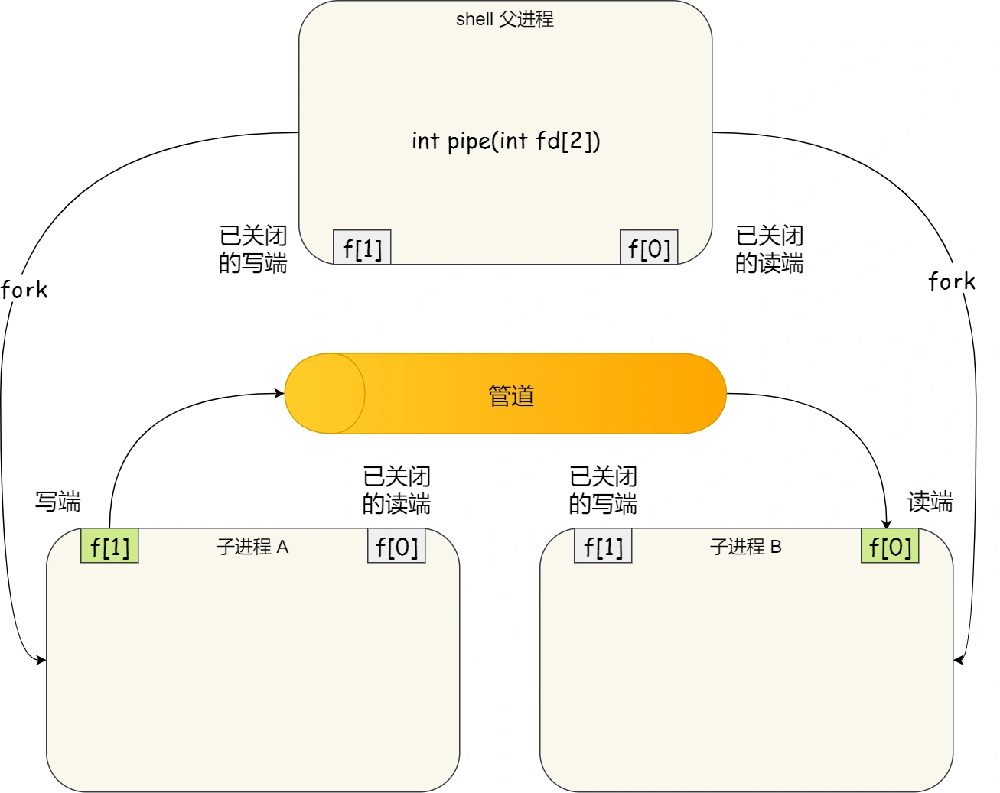
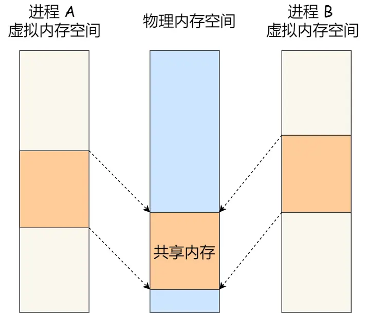
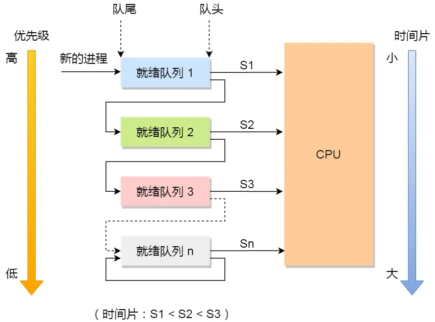
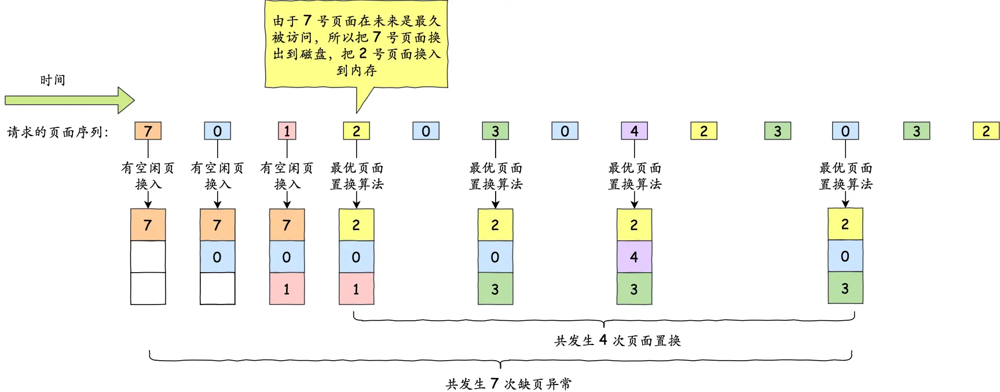

# 硬件结构

# CPU

## 冯诺依曼模型

计算机基本结构：**运算器、控制器、存储器、输入设备、输出设备**

## 寄存器种类

* 通用寄存器：存放需要运算的数据，如存放两个需要相加的数据

* 程序计数器：存放下一条将要执行的指令的**内存地址**

* 指令寄存器：存放正在运行的**指令本身**

## CPU执行顺序

1. CPU 通过程序计数器读取对应内存地址的指令，这个部分称为 **Fetch（取得指令）**；
2. CPU 对指令进行解码，这个部分称为 **Decode（指令译码）**；
3. CPU 执行指令，这个部分称为 **Execution（执行指令）**；
4. CPU 将计算结果存回寄存器或者将寄存器的值存入内存，这个部分称为 **Store（数据回写）**

上面这 4 个阶段，我们称为**指令周期（*Instrution Cycle*）**

## CPU总结

* 通常来说 64 位 CPU 的地址总线是 48 位，而 32 位 CPU 的地址总线是 32 位
* 硬件的 64 位和 32 位指的是 CPU 的位宽，软件的 64 位和 32 位指的是指令的位宽


# 存储结构

1. 寄存器：0.5个时钟周期左右
2. 高速缓存（SRAM    Static Random Access Memory）：
    * L1：2~4个时钟周期，分为数据缓存和指令缓存，每一块cpu核心都有
    * L2：10~20个时钟周期，每一块cpu核心都有
    * L3：20~60个时钟周期，多个cpu核心共用
3. 内存（DRAM    Dynamic Random Access Memory）：200~300个时钟周期左右
4. 固态硬盘（大概比内存慢10~1000倍左右）/机械硬盘（大概比内存慢10w倍）

**每个存储器只和相邻的一层存储器设备打交道**

## Cache：


CPU Cache 的数据是从内存中读取过来的，它是以一小块一小块读取数据的，而不是按照单个数组元素来读取数据的，在 CPU Cache 中的，这样一小块一小块的数据，称为 **Cache Line（缓存块）**。

比如，有一个 `int array[100]` 的数组，当载入 `array[0]` 时，由于这个数组元素的大小在内存只占 4 字节，不足 64 字节，CPU 就会**顺序加载**数组元素到 `array[15]`，意味着 `array[0]~array[15]` 数组元素都会被缓存在 CPU Cache 中了，因此当下次访问这些数组元素时，会直接从 CPU Cache 读取，而不用再从内存中读取，大大提高了 CPU 读取数据的性能。

Cache如何读取数据：


## CPU结构


## 如何写出让CPU跑得更快的代码

* 提高数据缓存命中：按照内存布局顺序访问
* 提高指令缓存：有规律的条件分支语句能够让 CPU 的分支预测器发挥作用，如先排序再判断


## 缓存一致性

**Cache的数据写入**

* 写直达：

    * 如果数据已经在 Cache 里面，先将数据更新到 Cache 里面，再写入到内存里面；
    * 如果数据没有在 Cache 里面，就直接把数据更新到内存里面。

    每次写操作都会写回内存，性能收到影响

* 写回：

    当发生写操作时，新的数据仅仅被写入 Cache Block 里，只有当修改过的 Cache Block「被替换」时才需要写到内存中

    * 如果当发生写操作时，数据已经在 CPU Cache 里的话，则把数据更新到 CPU Cache 里，同时标记 CPU Cache 里的这个 Cache Block 为脏（Dirty）的，这个脏的标记代表这个时候，我们 CPU Cache 里面的这个 Cache Block 的数据和内存是不一致的，这种情况是不用把数据写到内存里的；
    * 如果当发生写操作时，数据所对应的 Cache Block 里存放的是「别的内存地址的数据」的话，就要检查这个 Cache Block 里的数据有没有被标记为脏的：
        * 如果是脏的话，我们就要把这个 Cache Block 里的数据写回到内存，然后再把当前要写入的数据，先从内存读入到 Cache Block 里（注意，这一步不是没用的，具体为什么要这一步，可以看这个「[回答 (opens new window)](https://stackoverflow.com/questions/26672661/for-write-back-cache-policy-why-data-should-first-be-read-from-memory-before-w)」），然后再把当前要写入的数据写入到 Cache Block，最后也把它标记为脏的；
        * 如果不是脏的话，把当前要写入的数据先从内存读入到 Cache Block 里，接着将数据写入到这个 Cache Block 里，然后再把这个 Cache Block 标记为脏的就好了。


**多核心之间的缓存一致性**

* 写传播：某个核心的Cache更新的时候，需要同步到其他核心的Cache中
* 串行化：保证不同核心对同一数据的更改遵循同一个顺序变化

如何实现？

基于总线嗅探（当一个核心修改了缓存中的值，就会通过总线将事件广播给其他核心，所有核心都监听总线上的广播事件）的MESI（Modified、Exclusive、Shared、Invalid）协议


## 数据伪共享

**原因：**

同一个Cache Line中的数据被多个线程频繁修改，Cache和内存之间频繁读写，实际上没有起到缓存的作用

**解决思路：**空间换时间，避免频繁修改的数据出现在同一个Cache Line中

* Linux内核中的`__cacheline_aligned_in_smp`宏定义，值为`__cacheline_aligned`，也就是Cache Line的大小

*  Java 并发框架 Disruptor 使用「字节填充 + 继承」的方式，来避免伪共享的问题，JVM中父类和子类的内存地址是连续的，因此只需要在父类中填充7个long类型的数据，子类填写真正的数据，孙子类再填充7个long类型的数据即可

    伪代码：

    ```java
     //在序号实际value变量（long型）左边填充7个long变量
     class LhsPadding
    {
        protected long p1, p2, p3, p4, p5, p6, p7;
    }
    class Value extends LhsPadding
    {
        protected volatile long value;
    }
    //在序号实际value变量（long型）右边填充7个long变量
    class RhsPadding extends Value
    {
        protected long p9, p10, p11, p12, p13, p14, p15;
    }
    public class Sequence extends RhsPadding
    ```


## 中断

为了避免由于中断处理程序执行时间过长，而影响正常进程的调度，Linux 将中断处理程序分为上半部和下半部：

* 上半部，对应硬中断，由硬件触发中断，用来快速处理中断；
* 下半部，对应软中断，由内核触发中断，用来异步处理上半部未完成的工作；


## 内核架构

对于内核的架构一般有这三种类型：

* 宏内核，包含多个模块，整个内核像一个完整的程序；
* 微内核，有一个最小版本的内核，一些模块和服务则由用户态管理；
* 混合内核，是宏内核和微内核的结合体，内核中抽象出了微内核的概念，也就是内核中会有一个小型的内核，其他模块就在这个基础上搭建，整个内核是个完整的程序；

Linux 的内核设计是采用了宏内核，Window 的内核设计则是采用了混合内核，鸿蒙系统使用微内核。

这两个操作系统的可执行文件格式也不一样， Linux 可执行文件格式叫作 ELF，Windows 可执行文件格式叫作 PE。


# 内存管理


## 虚拟内存

为了在多进程环境下，使得进程之间的内存地址不受影响，相互隔离，于是操作系统就为每个进程独立分配一套**虚拟地址空间**，在Linux操作系统中，虚拟地址空间分为**内核空间**和**用户空间**。用户空间分布如下：


* 代码段，包括二进制可执行代码；
* 数据段，包括已初始化的静态常量和全局变量；
* BSS 段，包括未初始化的静态变量和全局变量；
* 堆段，包括动态分配的内存，从低地址开始向上增长；
* 文件映射段，包括动态库、共享内存等，从低地址开始向上增长；
* 栈段，包括局部变量和函数调用的上下文等。栈的大小是固定的，一般是 `8 MB`。当然系统也提供了参数，以便我们自定义大小；

在这 6 个内存段中，堆和文件映射段的内存是动态分配的。

**内存映射：**

对于虚拟地址与物理地址的映射关系，可以有**分段**和**分页**的方式，同时两者结合都是可以的。

* 分段：内存分段是根据程序的逻辑角度，分成了栈段、堆段、数据段、代码段等，这样可以分离出不同属性的段，同时是一块连续的空间。

    缺点：每个段的大小都不是统一的，这就会导致**外部内存碎片**和**内存交换效率低（经常需要和硬盘IO）**的问题。

* 分页：把虚拟空间和物理空间分成大小固定的页。由于分了页后，就不会产生细小的内存碎片，解决了内存分段的外部内存碎片问题。同时在内存交换的时候，写入硬盘也就一个页或几个页，这就大大**提高了内存交换的效率**。

    缺点：简单分页产生的页表过大

    解决方法：多级页表（页表过多导致CPU寻址过程层数太多，加大了时间的开销。根据**局部性原理**，在CPU中加入TLB（页表缓存），用来缓存最近访问的页表，这个缓存的命中率很高，大大提高了内存交换的效率）

**虚拟内存的好处：**

1. 虚拟内存可以使得进程的运行内存远超物理内存大小，因为程序符合局部性原理，CPU访问内存有明显的重复性，对于没有被经常访问的内存，我们可以把他换出到物理内存之外，如硬盘的swap区域
2. 每个进程有自己的页表，这些页表是私有的，解决了多进程之间地址冲突的问题
3. 页表中的页表项中除了物理地址之外，还有一些bit用做标记，如一个页的读写权限，标记该页是否存在等。因此在内存访问方面，操作系统提供了更好的安全性。


## 内存回收

内核在分配内存的时候，如果物理内存不足，就会触发内存回收机制，主要有两种方式：

* 后台内存回收：唤醒`kswapd`内核线程来回收内存，这个回收过程是**异步**的，不会阻塞线程的执行
* 直接内存回收：如果后台异步回收跟不上进程申请内存的速度，就会开始直接回收，这个回收过程是**同步**的，会阻塞线程的执行

可以被回收的内存类型有两类：

* 文件页：如果是干净页，直接回收，下次读取的时候再从磁盘读取；如果是脏页，则先写入磁盘再回收（和磁盘IO，影响性能）
* 匿名页：如果开启了Swap机制，那么Swap机制会将不常当问的匿名页换出到磁盘中，下次访问的时候再从磁盘读取（影响性能）

上述回收策略都是基于**LRU（Least Recently Used）算法**的，即优先回收不常访问的内存。

若直接内存回收后，空闲的物理内存大小还是不足，就会触发OOM（Out Of Memory）机制，OOM Killer会根据每个进程的内存占用情况和`oom_score_adj `的值进行打分，分值最高的进程会被kill掉。


## 内存申请

如果一个进程申请的内存超过机器本身的内存大小，会发生什么？如，在物理内存为4G的机器上申请8G的内存。

* 在32位的系统中，因为进程理论上最多能申请3G大小的虚拟内存，直接申请8G内存，会申请失败
* 在64位的系统中，进程理论上最多能申请128T大小的虚拟内存，因此只要不超过128T，都可以申请。如果要访问这些虚拟内存，要看系统有没有Swap分区，
    * 如果有，那么申请的8G内存可以使用，但是内存和硬盘之间会频繁地IO
    * 如果没有，那么进程会由于物理内存不足而被kill掉，原因是Out Of Memory


## 预读失败和缓存污染

**预读机制**：

例子：应用程序读取4kb的文件内容，操作系统处于空间局部性原理，会一次性将16kb的文件内容都读进缓存里，这多出来的12kb的内容就是预读内容，以减少磁盘的IO

**预读失败：**

如果上述预读内容没有被访问，就是预读失败

**缓存污染：**

当我们在批量读取数据的时候，由于数据被访问，这些数据都会被加入到活跃链表里，从而将真正的热点数据淘汰掉，导致热点数据的缓存命中率很低，这说明缓存被污染了


传统的LRU算法无法避免以下两个问题：

* 预读失败
* 缓存污染

这两个问题都会导致**缓存的命中率降低**

**如何改进预读失败：**

* Linux：
    * 维护两个链表，一个活跃链表（Active List），一个非活跃链表（Inactive List）
    * 预读的数据放入非活跃链表头节点中，只有真正读取的时候才加入活跃链表的头节点中
    * 活跃链表的数据被淘汰后加入到非活跃链表的头节点中，不会被真正淘汰

* Mysql：
    * 将一个链表划分为Young区域和Old区域，默认比例是63：37
    * 同上

**如何改进缓存污染：**

造成缓存污染的根本原因是数据进入活跃链表或Young区域的门槛太低，改进方法：

* Linux：
    * 在内存页被**第二次**访问的时候，才将页从Inactive List升级到Active List
* Mysql：
    * 在内存页被**第二次**访问的时候，判断
        * 如果两次访问的时间在1秒内（默认值），该页**不会**从old区域升级到young区域
        * 如果两次访问的时间超过1秒，该页就**会**从Old区域升级到young区域


## Linux虚拟内存管理

### 用户态

进程在Linux内核中的描述符task_struct结构如下：

```c
struct task_struct {
        // 进程id
	    pid_t				pid;
        // 用于标识线程所属的进程 pid
	    pid_t				tgid;
        // 进程打开的文件信息
        struct files_struct		*files;
        // 内存描述符表示进程虚拟地址空间
        struct mm_struct		*mm;

        .......... 省略 .......
}
```

> 父进程与子进程的区别，进程与线程的区别，以及内核线程与用户态线程的区别其实都是围绕着这个 **mm_struct** 展开的。

用`fork()`函数的时候，它会将父进程的虚拟内存空间以及相关页表拷贝一份进新进程里；

用`vfork()`或者`clone()`系统调用的时候，它会直接将父进程的虚拟内存空间以及相关页表直接赋值给子进程，这样一来子进程和父进程就会共享内存

**是否共享地址空间几乎是进程和线程之间的本质区别。Linux 内核并不区别对待它们，线程对于内核来说仅仅是一个共享特定资源的进程而已**。

mm_struct的结构如下：

```c
struct mm_struct {
    unsigned long task_size;    /* size of task vm space */
    unsigned long start_code, end_code, start_data, end_data;
    unsigned long start_brk, brk, start_stack;
    unsigned long arg_start, arg_end, env_start, env_end;
    unsigned long mmap_base;  /* base of mmap area */
    unsigned long total_vm;    /* Total pages mapped */
    unsigned long locked_vm;  /* Pages that have PG_mlocked set */
    unsigned long pinned_vm;  /* Refcount permanently increased */
    unsigned long data_vm;    /* VM_WRITE & ~VM_SHARED & ~VM_STACK */
    unsigned long exec_vm;    /* VM_EXEC & ~VM_WRITE & ~VM_STACK */
    unsigned long stack_vm;    /* VM_STACK */

       ...... 省略 ........
    struct vm_area_struct *mmap;		/* list of VMAs */
    struct rb_root mm_rb;
}
```

`arg_start `和` arg_end `是参数列表的位置，` env_start` 和` env_end `是环境变量的位置。它们都位于栈中的最高地址处。

`total_vm `表示在进程虚拟内存空间中总共与物理内存映射的页的总数。


**jvm的字节码储存在OS的堆里**，因此OS的堆可读可写可执行

结构体`vm_area_struct`用来表示上述堆、栈等具体的结构，结构体的定义如下：

```c
struct vm_area_struct {

    struct vm_area_struct *vm_next, *vm_prev;
	unsigned long vm_start;		/* Our start address within vm_mm. */
	unsigned long vm_end;		/* The first byte after our end address
					   within vm_mm. */
	/*
	 * Access permissions of this VMA.
	 */
	pgprot_t vm_page_prot;	//权限控制
	unsigned long vm_flags;	//权限控制

	struct anon_vma *anon_vma;	/* Serialized by page_table_lock */
    struct file * vm_file;		/* File we map to (can be NULL). */
	unsigned long vm_pgoff;		/* Offset (within vm_file) in PAGE_SIZE
					   units */	
	void * vm_private_data;		/* was vm_pte (shared mem) */
	/* Function pointers to deal with this struct. */
	const struct vm_operations_struct *vm_ops;
}
```

`vm_area_struct` 结构描述的是 [vm_start，vm_end) 这样一段左闭右开的虚拟内存区域


内核中通过一个struct `vm_area_struc`t结构的双向链表（方便遍历）以及红黑树（方便查找）将虚拟内存串起来，地址由低到高，尾节点的next指向NULL

* 双向链表头节点存储在strcut `mm_strcut`的`mmap`中
* 红黑树的根节点存储在strcut `mm_strcut`的`mm_rb`中

具体结构如下：


### 内核态

32位：


64位：


## 物理内存

结构：具体看CPU结构那一章


 DRAM 芯片就包装在存储器模块中，每个存储器模块中包含 **8 个 DRAM 芯片**，依次编号为 0 - 7 。


每一个 DRAM 芯片的存储结构是一个二维矩阵，二维矩阵中存储的元素我们称为超单元（supercell），每个 supercell 大小为**一个字节（8 bit）**。

因此，在程序员眼里连续的物理内存地址实际上在物理上是**不连续**的。因为这连续的 8 个字节其实是存储于不同的 DRAM 芯片上的。每个 DRAM 芯片存储一个字节（supercell）。


# 进程管理

## 基础知识

线程是调度的基本单位，进程则是资源分配的基本单位。

### **进程的状态：**

- 运行状态：该时刻进程占用cpu
- 就绪状态：可运行，由于其他进程占用CPU而暂时停止运行
- 阻塞状态：该进程正在等待某一事件发生而暂时停止运行（如等待I/O），此时就算给他CPU控制权，它也无法运行
- 创建状态：进程正在被创建
- 结束状态：进程正在从系统消失
- 就绪挂起：进程在外存（如硬盘），但只要进入内存，马上就能运行
- 阻塞挂起：进程在外存，并等待某个事件的出现


### **进程的控制结构**

在操作系统中，使用**进程控制块**（process control block，PCB）数据结构来描述进程

PCB是进程存在的唯一标识，这意味着一个进程的存在，必然会有一个 PCB，如果进程消失了，那么 PCB 也会随之消失。


**PCB包含的信息**

- 进程描述信息：
    - 进程标识符：标识进程，每一个进程都只有一个唯一的标识符
    - 用户标识符：标识进程所属的用户，主要为共享和保护服务
- 进程控制和管理状态
    - 进程的当前状态：如new，blocked，ready等
    - 进程的优先级：抢占CPU时的优先级
- 资源分配清单
    - 有关内存地址或虚拟地址的信息
    - 打开的文件列表和使用的I/O设备信息
- CPU相关信息
    - CPU中各个寄存器的值，当进程被切换的时候，CPU的状态信息会被保存在PCB里，以便进程重新执行的时候，能够从断点处继续执行

**PCB组织方式：**

PCB通过**链表**的方式组织，把**具有相同状态**的PCB链在一起，组成各种队列，如就绪队列等


### 线程

线程是进程当中的一条执行路径，多个进程在同一个线程中可以共享代码段、数据段、打开的文件资源等，但是每一个线程有自己独立的**寄存器和栈**


## 进程通信

### 管道

先进先出，效率较低

1. 匿名管道：只能作用于父子关系的进程。通过 fork 来复制父进程 fd 文件描述符，来达到通信的目的
2. 命名管道：可以在不相关的进程之间通信。创建了一个类型为p的管道的设备文件，在进程里只要使用这个设备文件，就可以相互通信




### 消息队列

消息队列是保存在**系统内核**中的消息链表

**消息队列生命周期随内核**，如果没有释放消息队列或者没有关闭操作系统，消息队列会一直存在

优点：

- 进程之间可以频繁通信

缺点：

- 通信不及时
- 通信大小有限制（信息大小、列表大小都有限制）
- 通信过程存在用户态和内核态之间的数据拷贝开销


### 共享内存

共享内存的机制，就是拿出一块虚拟地址空间来，映射到相同的物理内存中




### 信号量

信号量是一个**整型**的计数器，用于实现进程之间的**互斥和同步**

- P操作：信号量-1
- V操作：信号量+1

这两个操作必须**成对出现**

- 互斥信号量，信号量设为1

    

- 同步信号量，信号量设为0

    


### 信号

进程间通信的**唯一异步机制**，用于**异常情况**下的工作模式

信号事件的来源主要有硬件来源（如键盘 Cltr+C ）和软件来源（如 kill 命令）


### Socket

```c
int socket(int domain, int type, int protocal)
```

三个参数分别代表：

* domain 参数用来指定协议族，比如` AF_INET` 用于 IPV4、`AF_INET6 `用于 IPV6、`AF_LOCAL/AF_UNIX` 用于本机；
* type 参数用来指定通信特性，比如` SOCK_STREAM `表示的是字节流，对应 TCP、`SOCK_DGRAM` 表示的是数据报，对应 UDP、`SOCK_RAW `表示的是原始套接字；
* protocal 参数原本是用来指定通信协议的，但现在基本废弃。因为协议已经通过前面两个参数指定完成，protocol 目前一般写成 0 即可；

TCP和UDP需要绑定IP地址和端口，本地socket只需要绑定一个本地文件


## 多线程

### 锁

- 忙等待锁（自旋锁）

    ```c
    // 原子操作
    int TestAndSet(int *old_ptr, int new){
        int old = *old_ptr;
        *old_ptr = new;
        return old;
    }
    
    
    
    typedef struct lock_t{
        int flag;
    } lock_t;
    
    void init(lock_t *lock){
        lock->flag = 0;
    }
    
    void lock(lock_t *lock){
        // 没有获取到锁的时候，本线程会一直忙等
        while(TestAndSet(&lock->flag, 1) == 1){
            // do something
        }
    }
    
    void unlock(lock_t *lock){
        lock->flag = 0;
    }
    ```

    在单处理器上，必须抢占式的调度，因为自旋锁永远不会主动放弃CPU

- 无忙等待锁

    ```c
    typedef struct lock_t{
        int flag;
        queue_t *q; // 等待队列
    } lock_t;
    
    void init(lock_t *lock){
        lock->flag = 0;
        queue_init(lock->q);
    }
    
    void lock(lock_t *lock){
        // 没有获取到锁的时候，本线程会一直忙等
        while(TestAndSet(&lock->flag, 1) == 1){
            // 保存现在运行线程的TCB
            // 将现在运行的线程的TCB插入到等待队列
            // 设置该线程为等待状态
            // 调度线程
        }
    }
    
    void unlock(lock_t *lock){
        if(lock-> != NULL){
            // 取出等待队列的队头元素
            // 将该线程的TCB插入到就绪队列
            // 设置该线程为就绪状态
        }
        lock->flag = 0;
    }
    ```


### 信号量

```c
// 信号量数据结构
type struct sem_t{
    int sem;	// 资源个数
    queue_t *q;	// 等待队列
} sem_t;

// 初始化信号量
void init(sem_t *s. int sem){
    s->sem = sem;
    queue_init(s->q);
}

// P操作，原子操作
void P(sem_t *s){
    s->sem--;
    if(s->sem < 0){
        // 1. 保留当前线程的 CPU 现场
        // 2. 将该线程的 TCB 插入到 s 的等待队列
        // 3. 设置该线程为等待状态
        // 4. 执行调度程序
    }
}

// V操作，原子操作
void V(sem_t *s){
    s->sem++;
    if(s->sem <= 0){
        // 1. 取出 s 等待队列的队首元素
        // 2. 将该线程的 TCB 插入到就绪队列
        // 3. 设置该线程为 [就绪] 状态
    }
}
```

### 经典同步问题

#### 生产者消费者问题

[生产者消费者问题](https://xiaolincoding.com/os/4_process/multithread_sync.html#生产者-消费者问题)

#### 哲学家就餐

[哲学家就餐问题](https://xiaolincoding.com/os/4_process/multithread_sync.html#哲学家就餐问题)

- 吃东西的时候用互斥信号量（只能同时有一个人吃，效率低）
- 偶数哲学家先拿左边的叉子，再拿右边的叉子；奇数哲学家相反
- 用state[]记录每个哲学家的状态，同时拿两把叉子

#### 写者-读者问题

[读者-写者问题](https://xiaolincoding.com/os/4_process/multithread_sync.html#读者-写者问题)

- 读者优先
- 写者优先
- 公平策略

## 死锁

死锁产生条件（破坏其一都可以避免死锁）：

- 互斥
- 持有并等待
- 不可剥夺
- 环路等待

如何避免死锁：**资源的有序分配法**，所有获取资源的线程都按照一个特定的顺序获取资源（破坏了环路等待条件）


## 锁

### 互斥锁和自旋锁

- 互斥锁加锁失败后，线程会**释放CPU**，给其他线程，
    - 这意味着CPU会发生**上下文切换**（由内核来实现）
- 自旋锁加锁失败后，线程会**忙等待**，直到它拿到锁
    - 可以用`while`循环等待，不过最好用CPU提供的**`PAUSE`**指令来实现忙等，可以减少耗电量
    - 在单核CPU上使用自旋锁时，一定要使用抢占式的调度器，因为一个自旋的线程永远不会主动放弃CPU

总结：

- 若锁的代码运行的时间较短，用自旋锁；若较长，用互斥锁
- 这两个锁是基本锁，其他高级锁基本上由这两种基本锁实现


### 读写锁

和上面的读者-写者问题类似

读写锁在**读多写少**的情况下，能发挥优势


### 悲观锁和乐观锁

悲观锁：

他认为**多线程同时修改共享资源的概率比较高**，于是很容易出现冲突，所以访问共享资源前，先要上锁。

乐观锁：

他认为**多线程同时修改共享资源的概率比较低**，先修改完共享资源，再验证这段时间内有没有发生冲突，如果没有其他线程在修改资源，那么操作完成，如果发现有其他线程已经修改过这个资源，就放弃本次操作（如在线文档，git）。放弃本次操作之后，需要重试，**重试的成本非常高**。

所以**只有在冲突概率非常低，且加锁成本非常高的场景时，才考虑使用乐观锁**。


## 线程崩溃

如果进程访问非法内存，线程会立刻崩溃

JVM对信号做了特殊处理，所以当发生`StackoverflowError`和`NullPointerException`时，线程不会崩溃，而是让用户自己处理异常


# 调度算法

调度算法整体可以分为**抢占式**和**非抢占式**两种

1. 先来先服务（First Come First Serve，**FCFS**）
2. 最短作业优先（Shortest Job First，**SJF**）
3. 高响应比优先调度（High Response Ratio Next，**HRRN**）
4. 时间片轮转（Round Robin，**RR**）
5. 最高优先级调度算法（High Priority First，**HPF**）
6. 多级反馈队列（Multilevel Feedback Queue，**MFQ**）

## 进程调度算法

### 先来先服务

如果长作业先运行，那么对后面的短作业不友好


### 最短作业优先

如果短作业很多，那么对长作业不友好


### 高响应比优先调度

$$优先权=\frac{等待时间+要求服务时间}{要求服务时间}$$

- 如果等待时间相同，那么要求服务时间越短，优先级越高
- 如果要求服务时间相同，那么等待时间越长，优先级越高

是一种理想算法，现实中我们**不能预测**要求服务的时间


### 时间片轮转

- 时间片过短，导致过多的上下文切换，CPU效率低
- 时间片过长，人机交互不友好
- 一般来说，时间片在`20ms~50ms`比较合理


### 最高优先级调度算法

- 静态优先级：进程创建的时候就已经确定了
- 动态优先级：随着时间的推移增加进程的优先级
- 抢占式（一旦出现优先级高的进程，就将当前进程挂起，调度优先级高的进程）和非抢占式

可能会导致低优先级的进程**一直饥饿**


### 多级反馈队列



- 新进程会被放进**最高优先级队列的末尾**，若在规定时间片内未完成，则被放到下一队列
- 只有优先级较高的队列为空，才调度优先级低的队列；若此时有新进程，则将目前运行的进程挂起，放至原队列末尾，先执行新进程


## 页面置换算法

### 缺页中断

当CPU要访问的页不在物理内存的时候，就会发生缺页中断，与其他中断的区别在于：

- 缺页中断在指令执行**[期间]**产生和处理中断信号，而一般中断在一条指执行**[完成]**后检查和处理中断信号
- 缺页中断会**重新执行指令**，一般中断会**执行下一条指令**


页表项：


* *状态位*：用于表示该页是否有效，也就是说是否在物理内存中，供程序访问时参考。
* *访问字段*：用于记录该页在一段时间被访问的次数，供页面置换算法选择出页面时参考。
* *修改位*：表示该页在调入内存后是否有被修改过，由于内存中的每一页都在磁盘上保留一份副本，因此，如果没有修改，在置换该页时就不需要将该页写回到磁盘上，以减少系统的开销；如果已经被修改，则将该页重写到磁盘上，以保证磁盘中所保留的始终是最新的副本。
* *硬盘地址*：用于指出该页在硬盘上的地址，通常是物理块号，供调入该页时使用。


虚拟内存流程：


### 最佳页面置换

置换**未来**最长时间不访问的页



我们无法预知未来，所以最佳页面置换算法作用是为了衡量你的算法的效率，你的算法效率越接近该算法的效率，那么说明你的算法是高效的。


### 先进先出置换

选择在**内存驻留时间很长的页面**进行中置换


### 最近最久未使用置换算法

发生缺页时，**选择最长时间没有被访问的页面进行置换**，也就是说，该算法假设已经很久没有使用的页面很有可能在未来较长的一段时间内仍然不会被使用。


虽然 LRU 在理论上是可以实现的，但代价很高。为了完全实现 LRU，需要在内存中维护一个所有页面的链表，最近最多使用的页面在表头，最近最少使用的页面在表尾。

困难的是，在每次访问内存时都必须要更新「整个链表」。在链表中找到一个页面，删除它，然后把它移动到表头是一个非常费时的操作。

所以，LRU 虽然看上去不错，但是由于**开销比较大**，实际应用中比较少使用。


### 时钟页面置换

该算法的思路是，把所有的页面都保存在一个类似钟面的「环形链表」中，一个表针指向最老的页面。

当发生缺页中断时，算法首先检查表针指向的页面：

* 如果它的访问位位是 0 就淘汰该页面，并把新的页面插入这个位置，然后把表针前移一个位置；
* 如果访问位是 1 就把访问位置0，并把表针前移一个位置，重复这个过程直到找到了一个访问位为 0 的页面为止；


### 最不常用置换

当发生缺页中断时，选择「访问次数」最少的那个页面，并将其淘汰。

可以对每个页面增加一个「计数器」，这样做硬件成本高，且耗时

只考虑了频率，没考虑时间，可能会误伤刚开始频繁访问的页面，反而是那些以前频繁使用，但是现在不用的页得以保留


## 硬盘调度算法

